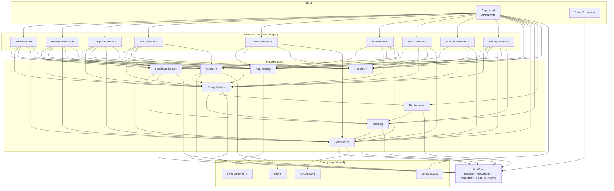

# 02 — Architecture

**Project:** `APPNAME` — a native SwiftUI iPhone and iPad Reddit client, written from scratch.
**Status:** design document. Normative for the build plan (`06-build-plan-and-acceptance.md`) and the one-shot prompt (`07-one-shot-prompt.md`).
**Companion documents:** `03-data-and-networking.md` (wire contract, domain model, persistence DDL), `04a-feeds-posts-comments.md` / `04b-media.md` / `04c-accounts-inbox-search-subs-settings.md` (per-screen feature specs), `05-monetization.md`, `06-build-plan-and-acceptance.md`, `07-one-shot-prompt.md`, `08-decisions-and-drift.md`.

---

## 0. Scope, inputs and non-goals

### 0.1 What this document decides

This document fixes the **structural** decisions: toolchain and build settings, module boundaries and allowed dependency edges, the app shell and routing model, the state and concurrency models, theming, the markdown pipeline, the media subsystem, the persistence layer, the entitlement seam, and the testing/observability posture. It does not specify individual screens — those belong to `04a`/`04b`/`04c` — and it does not specify the wire format — that belongs to `03`.

### 0.2 Inputs

The behavioral source of truth is the survey corpus in `docs/swift-rewrite/spec/` (files `01`–`09`), plus `spec/10-swiftui-2026-baseline.md`, whose "Verified GA as of 2026‑09‑17" section is treated as ground truth for platform capability. Where the surveys record drift between the original app's shipped documentation and its shipped code, **the code wins**, and the item is recorded by short name in `08-decisions-and-drift.md`.

### 0.3 Clean-room constraint

No source code, artwork, icon art, font files or documentation prose from the original (AGPL) project may be copied. Behavior may be reproduced. Short functional UI strings (button labels, error sentences, menu item titles) may match, because they are functional and often dictated by Reddit itself. Everything else — theme catalogs, icon sets, guide text, app name, bundle identifier — is new. Placeholders used throughout: app name `APPNAME`, bundle identifier `com.OWNER.appname`, URL scheme `appname`.

### 0.4 Explicit non-goals for v1

| Non-goal | Why | Door left open (§ reference) |
|---|---|---|
| Three-or-more panes on iPad, and an app-level sidebar | The original ships exactly two panes and lists more as "Unlikely"; the owner asked for parity, not for a new layout language. **Two-pane split view itself is in scope** — §5.15 | §5.15, §19 |
| AI summaries, AI/"smart" filters | Removed by the owner; never existed in shipped code either | — |
| Push notifications / Inbox Alerts | Removed by the owner; shipped code has only a foreground poll + badge | §14.1 |
| An `APPNAME` backend server | Only ever used for guide search; replaced on-device | §11.6, `03 §9` |
| Android | Out of scope | — |
| Over-the-air bundle updates | Not a concept in a native app | — |
| Multireddit create/rename/delete | Reddit web-only in the original; parity | `04c` |

---

## 1. Targets and toolchain

### 1.1 Versions

| Item | Value | Rationale |
|---|---|---|
| Xcode | **27.0 GA** (not 27.1/27.2 beta) | 27.1 has not shipped; 27.2 beta carries a known SDK deployment-target bug (`spec/10 §B3`) |
| SDK | **iOS 27.0** | Mandatory for App Store uploads from April 2027; opens Liquid Glass, `swipeActions` outside `List`, `AsyncImage` HTTP caching, `toolbarMinimizationBehavior`, `MetricManager` |
| Swift | **6.4**, language mode **6** | Ships in Xcode 27 |
| Deployment target | **iOS 26.0** | iOS 26 was on 79 % of all iPhones / 86 % of the last four years' iPhones as of 2026‑06‑07; iOS 27 is days old. Every architectural dependency (Liquid Glass, `Tab`, `WebPage`/`WebView`, `TextEditor` + `AttributedString`, `BGContinuedProcessingTask`) exists at 26.0 |
| Devices | iPhone **and iPad** (`TARGETED_DEVICE_FAMILY = 1,2`) | Product decision; the original's iPad split view is reproduced (§5.15) |
| Orientation | **iPhone:** portrait only for the app, all orientations for the media viewer and the in-app browser scenes. **iPad:** all four orientations, always, on every screen | `spec/01 §1.5`, `spec/05 §2.1`; §5.11 and §5.15 for the iPad policy |
| Windowing | Freely resizable on iPadOS 26+; `UIRequiresFullScreen` is **never** declared; a best-effort minimum window size is requested at scene connect (§5.15) | [TN3192](https://developer.apple.com/documentation/technotes/tn3192-migrating-your-app-from-the-deprecated-uirequiresfullscreen-key), [WWDC25 282](https://developer.apple.com/videos/play/wwdc2025/282/) |

**Reassess the floor at iOS 27 adoption ≥ 70 %** (Apple publishes at `developer.apple.com/support/app-store`), expected roughly Q1 2027. That is a one-line change plus deletion of the `@available` shims catalogued in §1.3.

### 1.2 Two hard gates from building against the 27 SDK

1. The app **must** adopt the scene-based lifecycle or it will not launch. SwiftUI's `App` + `WindowGroup` satisfies this natively; we must not add an `UIApplicationDelegate`-only path, and we must not touch the deprecated `UIApplication.statusBar*` APIs (they can return NaN/null under this SDK).
2. The app **must** ship a launch screen. We use `UILaunchScreen` in `Info.plist` with a solid background colour and a single centred logo image, matching the first painted frame of the SwiftUI splash so the transition is invisible (`spec/01 §2`, `spec/09 §8`).

`UIDesignRequiresCompatibility` is ignored under the 27 SDK and must not be added. Liquid Glass is not optional; see §5.10.

### 1.3 `@available` shims we accept

Everything in this table is additive. Each site is a two-branch `if #available(iOS 27, *)`, tagged with `// FLOOR-27:` so the cleanup is a single grep when the floor moves.

| API | 27-only behavior | 26 fallback |
|---|---|---|
| `AsyncImage(request:…)` + `View.asyncImageURLSession(_:)` | Shared tuned `URLSession`/`URLCache` for avatars and icons | `AsyncImage(url:)` with the default session |
| `swipeActions(edge:allowsFullSwipe:content:onPresentationChanged:)` outside `List` | Native swipe actions for feed cards; `onPresentationChanged` pauses video | Our own `SwipeActionsContainer` pan-gesture implementation (§5.12) — which we ship regardless, because the four-band short/long semantics are not expressible with system swipe actions |
| `toolbarMinimizationBehavior(_:for:)`, `visibilityPriority(_:)`, `ToolbarOverflowMenu`, `topBarPinnedTrailing` | Richer toolbar behavior | Plain `.toolbar` placements |
| `MetricManager` (`AsyncStream` of `MetricReport`/`DiagnosticReport`) | Telemetry (§17.2) | Telemetry simply not collected on 26; we do **not** fall back to `MXMetricManager` |
| `prominent` tab role, `TabsPickerStyle` | Not used in v1 | — |

Two 27-SDK behaviors are *compiler*, not runtime, and therefore always on: the `@State` macro (§18.3) and the new system text-selection gesture for `Text` + `.textSelection(.enabled)` (§18.4).

### 1.4 Build settings (normative)

Set at the **project** level in an `.xcconfig` per configuration, inherited by every target and every local Swift package.

```
SWIFT_VERSION                          = 6.0        // language mode 6
SWIFT_APPROACHABLE_CONCURRENCY         = YES
SWIFT_DEFAULT_ACTOR_ISOLATION          = MainActor
SWIFT_STRICT_CONCURRENCY               = complete
SWIFT_UPCOMING_FEATURE_*               = YES        // all available upcoming features enabled
ENABLE_USER_SCRIPT_SANDBOXING          = YES
DEAD_CODE_STRIPPING                    = YES
ENABLE_MODULE_VERIFIER                 = YES
GCC_TREAT_WARNINGS_AS_ERRORS           = YES        // Debug and Release
SWIFT_TREAT_WARNINGS_AS_ERRORS         = YES        // Debug and Release
CLANG_ANALYZER_*                       = YES
SWIFT_COMPILATION_MODE  (Release)      = wholemodule
SWIFT_OPTIMIZATION_LEVEL (Release)     = -O
ENABLE_TESTABILITY (Debug)             = YES
OTHER_SWIFT_FLAGS (Debug)              = -warn-long-function-bodies=300 -warn-long-expression-type-checking=300
IPHONEOS_DEPLOYMENT_TARGET             = 26.0
TARGETED_DEVICE_FAMILY                 = 1,2      // iPhone and iPad
```

**Warnings-as-errors policy.** Warnings are errors in every configuration, for first-party code, from commit one. The only sanctioned escape is a file-scoped or declaration-scoped suppression with a `// WARNING-EXEMPT(<reason>, <owner>, <expiry-date>)` comment; CI fails on any exemption past its expiry. Third-party packages are consumed with warnings **not** escalated (SwiftPM does this by default for dependencies).

**Concurrency posture.** `SWIFT_DEFAULT_ACTOR_ISOLATION = MainActor` means everything is main-actor-isolated unless it says otherwise. That is the right default for a UI app and it is what Apple's own SwiftUI code now assumes. The corollary, spelled out in the iOS 27 release notes, is the trap that matters most here: *an unannotated `nonisolated async` method runs on the main actor*. Every piece of off-main work — JSON decoding, markdown parsing, SQLite reads, filter evaluation, image decode — must be **explicitly `@concurrent`** or isolated to a named actor. See §7.

### 1.5 Linting and formatting

- `swift format` (in-toolchain) with a checked-in `.swift-format`; `swift format lint --strict` in CI.
- SwiftLint for rules the formatter does not express: `force_unwrapping`, `force_try`, `implicitly_unwrapped_optional`, `todo` (warning with a required issue link), a `file_length` of 500 and a `type_body_length` of 300, plus a custom rule banning `DispatchQueue`, `ObservableObject`, `@StateObject`, `@Published`, `NSAttributedString(data:options:)`, and `canOpenURL`.
- A custom SwiftLint rule `no_clean_room_violation` greps for the original project's name, bundle id, Sentry DSN and asset filenames so a copy-paste accident fails the build.

---

## 2. Project generation

### 2.1 Decision: **plain `.xcodeproj`, checked in, with the app target as a thin shell over local Swift packages.**

| Option | Verdict | Reasoning |
|---|---|---|
| Plain `.xcodeproj` | **Chosen** | The merge-conflict pain that motivates generators is proportional to how much lives in the project file. With the **18** local SPM packages of §2.2/§3.1 and an app target containing under 20 files, the `.pbxproj` barely changes. No extra toolchain, no generation step in CI, no risk of a generator lagging Xcode 27. |
| XcodeGen | Rejected | Buys merge-friendliness we get for free by pushing code into packages, and adds a generation step every contributor and every CI job must run. |
| Tuist | Rejected for v1 | Genuinely good at this scale and above, but it is a second build system to learn and to keep current with Xcode 27, and its caching pays off with large teams. Revisit if the app target grows past ~5 targets or the team past ~4 engineers. |
| JSON `.xcproj` (Xcode 27.2 beta) | **Watch, do not adopt** | It is exactly what we want — readable, merge-friendly, agent-editable — but it is beta in a beta Xcode, and 27.1 has not shipped. Migration is a file-format conversion in the file inspector, so adopting later is cheap. Recorded as `xcproj-format` in `08`. |

### 2.2 Repository layout

```
APPNAME/
├─ .xcconfig/                  Debug.xcconfig, Release.xcconfig, Shared.xcconfig
├─ App/                        app target: APPNAMEApp.swift, composition root, Info.plist,
│                              Assets.xcassets (icons only), launch screen, entitlements
├─ ShareExtension/             share extension target (§14.3)
├─ Packages/
│  ├─ AppCore/
│  ├─ RedditAPI/
│  ├─ Persistence/
│  ├─ RedditMarkdown/
│  ├─ Theming/
│  ├─ Entitlements/
│  ├─ MediaKit/
│  ├─ AppRouting/
│  ├─ DesignSystem/
│  └─ Features/
│     ├─ FeedFeature/
│     ├─ PostDetailFeature/
│     ├─ ComposerFeature/
│     ├─ MediaFeature/
│     ├─ AccountsFeature/
│     ├─ InboxFeature/
│     ├─ SearchFeature/
│     ├─ SubredditsFeature/
│     └─ SettingsFeature/
├─ Fixtures/                   captured Reddit JSON, markdown golden files (test resources)
├─ Tools/                      capture-fixtures script, theme-palette generator
└─ docs/
```

Each directory under `Packages/` is its own `Package.swift` with `swift-tools-version: 6.4` (which enables Swift Testing's Complete XCTest interop mode). The app target links the feature packages; feature packages link the infrastructure packages.

**This layout is the canonical package list.** There are exactly **18** local Swift packages — 9 infrastructure (`AppCore`, `RedditAPI`, `Persistence`, `RedditMarkdown`, `Theming`, `Entitlements`, `MediaKit`, `AppRouting`, `DesignSystem`) and 9 feature packages under `Packages/Features/` (`FeedFeature`, `PostDetailFeature`, `ComposerFeature`, `MediaFeature`, `AccountsFeature`, `InboxFeature`, `SearchFeature`, `SubredditsFeature`, `SettingsFeature`) — plus two non-package targets, the app shell and `ShareExtension`. `06-build-plan-and-acceptance.md` §1.2 and §6 use these names; nothing else does.

---

## 3. Module map

### 3.1 Packages and responsibilities

| # | Package | Responsibility | May depend on | Must not depend on |
|---|---|---|---|---|
| 1 | **AppCore** | Domain value types (`Post`, `Comment`, `Subreddit`, `User`, `Multireddit`, `InboxItem`, `PostMedia`, `Flair`, `Poll`, `VideoSource`); `RedditLink` URL parser/normalizer and `PageKind`; sort types; error taxonomy; formatters (`RelativeTime`, `CompactNumber`); the `Feature` enum; pure filter predicates; `Fullname`. No I/O, no SwiftUI, no Foundation networking. | nothing | everything |
| 2 | **RedditAPI** | `RedditClient` actor, request builder, endpoint catalog, decoding into AppCore types, `SessionStore` actor (cookies + modhash), `RedgifsResolver` actor, `OpenGraphFetcher`, login-flow policy object. | AppCore | SwiftUI, Persistence, any Feature |
| 3 | **Persistence** | GRDB database, migrations, six table stores, `SettingsStore` (`UserDefaults`-backed `@Observable`), `KeychainStore`, maintenance job. | AppCore, GRDB | SwiftUI (except a tiny `Environment` shim), RedditAPI, any Feature |
| 4 | **RedditMarkdown** | Reddit-flavored markdown → `MarkdownDocument` AST; SwiftUI block renderer; link-tap routing protocol; plain-text extraction (for filters, accessibility, "copy text"). | AppCore, Theming, swift-cmark-gfm | RedditAPI, Persistence |
| 5 | **Theming** | `Theme` model (20 colours + mode flags), `ThemeStore` `@Observable`, environment plumbing, theme import/export codec, Liquid Glass tint rules. | AppCore, Persistence (custom theme table) | RedditAPI, Features |
| 6 | **Entitlements** | `Entitlements` `@Observable`, the `Feature.isGated` table, `EntitlementProvider` protocol, the `requiresEntitlement(_:style:)` view modifier, `PaywallPresenter`, `PaywallSheet` / `PlusSettingsScreen` / `PlusBadge` / `FeatureLockView`. Ships a `FreeEverythingProvider` so the app is fully functional before `05` lands StoreKit. | AppCore, Theming (for the lock chrome), StoreKit | RedditAPI, Features |
| 7 | **MediaKit** | Image pipeline, `PlayerRegistry` actor, focus engine, video source ladder + fallbacks + watchdog, playback-position memory, Live Text bridge, save/share. Resolution of "lazy" sources is injected via a protocol. | AppCore, Theming, DesignSystem | RedditAPI (uses `VideoSourceResolving` protocol instead), Persistence |
| 8 | **AppRouting** | `Route` enum, `Router` per tab **and per split-view detail pane** (§5.15), `RouteResolver` (link → route), the `RouteDestination` classifier that decides pane-vs-tab placement (§5.15), deep-link/clipboard/share-extension intake, `ModalCoordinator` (single slot + startup priority queue), forward-navigation ("stack future") store. | AppCore | SwiftUI feature views, RedditAPI |
| 9 | **DesignSystem** | Theme-aware primitives: `SwipeActionsRow` (four-band), `ThemedList`, `SectionHeader`, `IconButton`, `TextButton`, `PulseHighlight`, `AlphabetScroller`, `ScrollToNextButton`, `ThemedRefreshable`, haptics facade, context-menu helpers, `EmptyStateView`, `AccessFailureView`. | AppCore, Theming, Entitlements | RedditAPI, Persistence, Features |
| 10 | **Features/**\* | One package per screen family. Owns its views, its `@Observable` view models, and its navigation intents. Talks to the world exclusively through protocols vended by AppCore. | AppCore, RedditAPI, Persistence, RedditMarkdown, Theming, MediaKit, AppRouting, DesignSystem, Entitlements | **any other Feature package** |
| 11 | **App target** | Composition root: constructs the concrete `RedditClient`, `Database`, `SettingsStore`, `ThemeStore`, `Entitlements`, `PlayerRegistry`, `InboxPoller`; injects them into the environment; owns the `App`/`Scene`, the `TabView`, startup sequencing, URL intake, Sentry/MetricKit init, alternate icons. | everything | — |
| 12 | **ShareExtension** | Receives one web URL, validates it with `RedditLink`, writes it to the App Group, and opens `appname://openurl?url=…`. | AppCore only | everything else |

### 3.2 Rules that make the graph hold

1. **No feature-to-feature edges.** When Feed needs to push a post detail, it emits a `Route`, and `AppRouting` resolves it. When Post Detail needs the composer, it presents a `ComposerRequest` through the modal coordinator. Cross-feature navigation is data, never a type reference.
2. **Infrastructure never imports a feature.** Enforced by a CI script that parses each `Package.swift` and fails on a disallowed edge.
3. **AppCore is SwiftUI-free and Foundation-light.** This keeps the domain model and the derivation rules in `03` unit-testable without a host app, and keeps the test suite fast.
4. **Protocols cross layers, concrete types do not.** `MediaKit` declares `VideoSourceResolving`; `RedditAPI`'s `RedgifsResolver` conforms; the app target wires them. Same pattern for `PostStore`, `SeenPostStore`, `EntitlementProvider`.
5. **Each package ships its own test target**, and each package's tests may import only that package plus `AppCore` and test-support.

### 3.3 Module dependency diagram



### 3.4 Third-party dependency policy

Every dependency must be (a) actively maintained on Swift 6 / Xcode 27, (b) pinned to an **exact** version in `Package.resolved`, (c) reviewed for licence compatibility (permissive only — MIT/Apache-2.0/BSD; **no AGPL or GPL**), and (d) reachable through a first-party protocol so it can be swapped.

**Allowed:**

| Package | Used by | Why it earns its place |
|---|---|---|
| **GRDB.swift** | Persistence | SwiftData is the wrong shape for this workload: multi-account writes, 5 000-row pruning sweeps, unique-key upserts, and synchronous existence checks on the feed scroll path. The 2026 community position is consistent and Apple shipped nothing in 2026 that changes it; iOS 27 still carries a `@Query`-plus-`ModelActor` deadlock class. GRDB gives explicit migrations, real `ON CONFLICT` upserts, `ValueObservation`, and raw SQL when needed. **SQLiteData (Point-Free)** is an acceptable substitute if the team prefers `@Query`-like ergonomics; it is GRDB underneath, so the schema in `03` is unchanged. Recorded as `persistence-wrapper` in `08`. |
| **Nuke** (+ `NukeUI` only if we use `LazyImage`) | MediaKit | iOS 27's `AsyncImage` HTTP caching removes the *default* reason to reach for a pipeline, not the reason for a media-heavy feed: we need prefetch-ahead on scroll, off-main decode, a memory-cost ceiling, per-request priority, and the "hand the loader an array of resolutions and let it pick" behavior. `AsyncImage` gives us none of those. **Scope:** Nuke is used for post media, the gallery grid and the fullscreen viewer only. Avatars, subreddit icons and flair emoji use `AsyncImage` with a tuned `URLCache` (27) or the default session (26). |
| **swift-cmark-gfm** (or `swift-markdown`, which vends the same cmark-gfm core) | RedditMarkdown | We need a real CommonMark+GFM parser we can extend with Reddit's dialect. `AttributedString(markdown:)` renders inline constructs only — no blockquotes, lists, code fences, tables or headings — and Reddit comments are block-heavy. See §9. |
| **sentry-cocoa** | App target | Symbolicated crash grouping, breadcrumbs and release health that MetricKit does not provide. Gated by the same opt-out setting as the original. |

**Rejected, with reasons:**

| Package | Why not |
|---|---|
| The Composable Architecture | A Reddit client's state is server-derived cache plus local UI state; it is not in TCA's sweet spot (exactly-answerable state: trading, multiplayer, complex undo). Vanilla MV/MVVM with `@Observable` is the 2026 consensus and is far cheaper to onboard into. |
| SwiftData | §3.4 above; also the fixed-deadlock note in iOS 27's release notes. |
| Kingfisher / SDWebImage | Objective-C-era lineage; Nuke is the modern Swift-concurrency-native option. One image pipeline, not two. |
| swift-markdown-ui | Opinionated renderer; we need spoilers, superscript, Reddit autolinks, giphy interception, theme chips and per-block tap routing. Extending it is more work than owning the renderer. |
| Alamofire | `URLSession` with a cookie-enabled ephemeral-free configuration is sufficient and is exactly what the cookie-session model needs. |
| RevenueCat | StoreKit 2 + `SubscriptionStoreView` covers a single-SKU subscription. No server, no third-party receipt vault. (`05` owns this; the seam in §6.5 does not care either way.) |
| Firebase / any analytics SDK | The original sent no analytics. We send none. Crash reporting only, opt-out. |
| Lottie, Pulse, IQKeyboardManager, R.swift | Not needed; String Catalogs and asset symbols cover the generated-accessor case. |
| Any package that vendors a WebAssembly/JS markdown renderer | The original bundled a compiled snudown. We parse natively (§9). |

---

## 4. Architectural style

**Vanilla MV / lightweight MVVM on Observation.** Views are structs; screen state lives in an `@Observable` model held by `@State` in the screen's root view; shared state lives in `@Observable` objects injected through `@Environment`; navigation state lives in a per-tab `Router`. No `ObservableObject`, no `@StateObject`, no `@Published`, no global singletons except the composition root's constructed graph.

Three rules keep this from degenerating:

1. **A view model owns a screen, not a widget.** A feed cell has no view model; it takes a `Post` and closures. This matters directly for performance (§18.1).
2. **View models never import SwiftUI.** They expose state and `async` methods. This makes them testable with Swift Testing and no host app.
3. **Side effects are injected.** A view model holds protocol-typed collaborators (`PostFetching`, `SeenPostStore`, `VoteService`), never a concrete client.

```swift
@MainActor @Observable
public final class FeedModel {
    public private(set) var items: [FeedItem] = []
    public private(set) var phase: LoadPhase = .idle          // idle | loading | loaded | failed(FeedError) | accessDenied(AccessFailure)
    public private(set) var footer: FeedFooter = .none        // none | loading | end | filterLimit | failed

    public init(target: FeedTarget, deps: FeedDependencies)
    public func onAppear() async
    public func loadMore() async
    public func refresh() async
    public func vote(_ item: FeedItem, _ direction: VoteDirection) async
    public func setSeen(_ item: FeedItem, _ seen: Bool) async
    public func hide(_ item: FeedItem) async
}
```

---

## 5. App lifecycle and shell

### 5.1 Scene structure

```swift
@main
struct APPNAMEApp: App {
    @State private var graph = AppGraph()      // composition root; see §5.3
    var body: some Scene {
        WindowGroup {
            RootView()
                .environment(graph.settings)
                .environment(graph.theme)
                .environment(graph.accounts)
                .environment(graph.subscriptions)
                .environment(graph.inbox)
                .environment(graph.entitlements)
                .environment(graph.playerRegistry)
                .environment(graph.modals)
                .environment(\.redditClient, graph.client)
                .environment(\.database, graph.database)
                .task { await graph.start() }
                .onOpenURL { graph.intake.handle(.url($0)) }
        }
    }
}
```

There is exactly one `WindowGroup`. The fullscreen media viewer is a `fullScreenCover` inside `RootView`, not a second scene, because it must share the `PlayerRegistry` and because dismissing it must restore the presenting screen's scroll position (`spec/05 §2.1`).

### 5.2 Startup sequence

Mapped from `spec/01 §1` and `spec/09 §11`. Three gates block first paint; everything else is deferred.

| Phase | Work | Blocking? | Notes |
|---|---|---|---|
| 0 | Sentry init from `allowErrorReporting` (default **true**), app-hang tracking **off** | Yes, but it is microseconds | Read the raw `UserDefaults` value before `SettingsStore` exists, to match "init before anything renders" (`spec/01 §1.2`) |
| 1 | `Database.open()` → `PRAGMA journal_mode=WAL` → run migrations | **Yes** | Migration failure is fatal-by-design: show a dedicated unrecoverable-error screen with a "reset local data" button rather than crashing |
| 2 | `VideoCache.clearIfRequested()` | **Yes** | Must complete before any `AVPlayer` exists (`spec/05 §12.2`) |
| 3 | Font registration | N/A | We ship no custom font. The original's SpaceMono is replaced by `.system(.body, design: .monospaced)` |
| 4 | `SettingsStore` + `ThemeStore` construction (synchronous `UserDefaults` + one SQLite read for the active custom theme) | **Yes** | Needed for the splash's own colours |
| 5 | Session restore: read `usernames` + `currentUser`, restore that account's cookie from Keychain, `GET /user/me/about.json`, capture modhash | **No** — splash stays up | Until this resolves, `RootView` renders `LaunchSplash` (theme-coloured background + logo + `ProgressView`), not the tab bar (`spec/01 §1.8`, `spec/01 §2`) |
| 6 | First paint of the `TabView` at the configured `initialTab`, or the `startupURL` route if one is set and parses | — | `spec/01 §3.3`, `spec/06 §2.5` |
| 7 | Deferred, after first frame: DB maintenance sweep; `appLaunches += 1`; `appForegrounds += 1`; subscription list load; inbox poll start | No | Use a low-priority `Task` started from `.task`, not `InteractionManager`'s literal equivalent |
| 8 | Startup modal evaluation (once per process) | No | §5.9 |

`scenePhase` transitions to `.active` increment `appForegrounds`, re-check the clipboard and the share-extension inbox, and resume the inbox poller. Transitions to `.background` tear down every `AVPlayer` (§10.3) and suspend the poller.

### 5.3 Composition root

`AppGraph` is a `@MainActor @Observable` final class constructed once. It owns:

```swift
@MainActor @Observable
public final class AppGraph {
    let database: Database                 // GRDB pool wrapper
    let settings: SettingsStore
    let theme: ThemeStore
    let client: RedditClient               // actor
    let session: SessionStore              // actor
    let accounts: AccountsStore
    let subscriptions: SubscriptionsStore
    let inbox: InboxPoller
    let entitlements: Entitlements
    let playerRegistry: PlayerRegistry     // actor-backed façade
    let modals: ModalCoordinator
    let intake: LinkIntake
    let routers: TabRouters
    func start() async
}
```

Nothing is a global `static let`. Tests construct an `AppGraph` with in-memory stores and a stub client.

### 5.4 Tab bar

Five tabs, fixed order and identity, using the iOS 18+ `Tab` builder plus iOS 26 bar behaviors.

| Index | `TabID` | Title | SF Symbol | Badge | Root route |
|---|---|---|---|---|---|
| 0 | `.posts` | "Posts" | `doc.text.image` | — | `.subreddits` |
| 1 | `.inbox` | "Inbox" | `envelope` | unread count when > 0 | `.inbox` |
| 2 | `.account` | username when logged in and `showUsername`, else "Account" | `person.crop.circle` | — (pulses when zero accounts) | `.user(me)` or `.accounts` |
| 3 | `.search` | "Search" | `magnifyingglass` | — | `.search` |
| 4 | `.settings` | "Settings" | `gearshape` | — | `.settings(.root)` |

```swift
TabView(selection: $selection) {
    Tab("Posts", systemImage: "doc.text.image", value: TabID.posts) { TabStack(.posts) }
    Tab("Inbox", systemImage: "envelope", value: TabID.inbox) { TabStack(.inbox) }
        .badge(inbox.unreadCount)
    …
}
.tabBarMinimizeBehavior(settings.hideTabsOnScroll ? .onScrollDown : .never)
```

- **Hide on scroll** uses `tabBarMinimizeBehavior(.onScrollDown)` rather than the original's hand-rolled 50 px / 5 px-delta translate animation. This is a deliberate fidelity trade: the system behavior is the Liquid Glass idiom, is free, and is what users on iOS 26+ expect. Recorded as `tab-hide-on-scroll` in `08`.
- **Tab re-tap pops one level.** The `selection` binding is intercepted: setting the same value while that tab's `Router.path` is non-empty calls `router.pop()` and leaves the selection unchanged. Repeated taps walk the stack one level per tap, never pop-to-root (`spec/01 §3.1`).
- **Tab long-press.** `.onLongPressGesture` on the tab's label content is not available for system `Tab`s; we attach a `simultaneousGesture(LongPressGesture(minimumDuration: 0.4))` to a transparent overlay aligned to the tab bar's slot geometry. Search long-press opens the Quick Subreddit Search sheet; Account long-press opens Quick Account Swap **only when at least one account exists**. Both fire `sensoryFeedback(.selection, …)` (`spec/01 §3.2`). If this overlay proves fragile across bar minimization states, the fallback is a `UITabBarController` interop shim behind `UIViewControllerRepresentable`; recorded as `tab-longpress-mechanism` in `08`.
- **First tap on the Search tab** shows the one-time "Did you know? You can quick search for subreddits by long pressing the search tab." alert (`spec/01 §3.1`, one-time-alert primitive in §5.13).
- **Content insets under the bar.** Which screens draw *beneath* the (glass) tab bar and which sit
  above it is a fixed allow-list, not a per-screen judgement call. **Beneath the bar, adding no bottom
  inset:** the feed screens (home, subreddit, multireddit, user), post detail, search results, the
  inbox list, Gallery Mode and the fullscreen media viewer. **Above the bar, taking
  `.safeAreaPadding(.bottom, tabBarHeight)`:** the Subreddits hub, Accounts, the message thread, the
  subreddit sidebar, the wiki, the plain web view, and every Settings screen. A screen in the first
  group must also keep its scroll content reachable — it relies on the bar minimizing on scroll — so a
  screen that does **not** scroll belongs in the second group (`spec/01` §3, §4.1, §16).
- **On iPad the same `TabView` renders its bar at the top**, as a floating Liquid Glass capsule, rather than along the bottom. We keep the plain `TabView` and do **not** apply `.tabViewStyle(.sidebarAdaptable)`; the reasoning, and the consequences for the inset allow-list above, are in §5.15. `[DECISION: split-view-tab-style]`
- **iOS 27 crash guard.** A `TabView` crashes if `selection` names a hidden or unavailable tab. Our tab set is fixed, so this cannot happen today, but `selection` is validated against the live tab set in one place (`TabRouters.validateSelection()`), so a future customisable tab bar cannot regress into it (`spec/10 §A3`).

### 5.5 Per-tab navigation stacks and the `Route` enum

Each tab hosts its own `NavigationStack` with its own `NavigationPath`-equivalent (`[Route]`, since every route is `Hashable` and we want to inspect the stack for the pop-one-level and forward-swipe behaviors).

```swift
public enum Route: Hashable, Sendable {
    case subreddits                                  // 1  the Posts tab root
    case home(FeedTarget)                            // 2  subscription feed (sort baked into target)
    case subredditFeed(FeedTarget)                   // 3  r/<name>, r/all, r/popular
    case multiredditFeed(FeedTarget)                 // 4  /user/<u>/m/<m>
    case userProfile(UserTarget)                     // 5  /user/<name>[/section]
    case postDetail(PostTarget)                      // 6  permalink + sort + t + context
    case subredditSearch(SubredditSearchTarget)      // 7  in-subreddit post search
    case search                                      // 8  global search tab root
    case sidebar(SubredditName)                      // 9  /r/<x>/about
    case wiki(WikiTarget)                            // 10 /r/<x>/wiki/<path>
    case gallery(FeedTarget)                         // 11 gallery mode over any feed target
    case accounts                                    // 12
    case inbox                                       // 13
    case messageThread(MessageID)                    // 14
    case settings(SettingsRoute)                     // 15 nested enum, one case per settings page
    case webView(WebViewTarget)                      // 16 in-app reskinned web page (report, wiki fallback)
    case unsupported(URL?)                           // 17 the error page
}
```

Design notes:

- **Typed payloads, not raw URL strings.** The original passed a URL string as the single parameter of every screen and re-parsed it everywhere. We parse once, at the boundary, into a value type. `FeedTarget` carries `{ kind: .home | .subreddit(name) | .multireddit(owner, name) | .user(name, section), sort: PostSort, time: TopWindow? }`. Every target exposes `var canonicalURL: URL` so sharing, "open in browser" and the stack-future restore remain lossless.
- **Sort changes do not push.** Changing sort mutates the top route in place (`router.replaceTop(_:)`), matching the original's `setParams` semantics (`spec/03 §16.1`).
- `settings(SettingsRoute)` replaces the original's string-matched `hydra://settings/...` dispatcher with a real enum, one case per page, each pushed as its own stack entry so the back gesture walks one settings level at a time (`spec/06 §1`).
- `Route` conforms to `Codable` so a stack can be persisted; v1 does not persist stacks, but the conformance costs nothing and is the enabling step for the "endpoint/navigation state caching" item the original listed as unimplemented.

```swift
@MainActor @Observable
public final class Router {
    public private(set) var path: [Route] = []
    public private(set) var future: [Route] = []          // forward history, §5.8
    public func push(_ route: Route)                       // clears `future`
    public func replaceTop(_ route: Route)                 // clears `future`
    public func pop()                                      // moves the popped route onto `future`
    public func popToRoot()
    public func goForward()                                // pops `future` back onto `path`
}
```

`TabRouters` holds one `Router` per `TabID` plus the current selection, and is the only object allowed to change the selection.

### 5.6 Link resolution: `RedditLink` → `Route`

`AppCore.RedditLink` owns host normalization, path classification and sort parsing; the full normative rules are in `03 §2`. `AppRouting.RouteResolver` maps its output to a `Route`, applying preferred-sort defaults on the way.

| `PageKind` (first match wins, priority order per `03 §2.3`) | Route |
|---|---|
| `.appAccounts` (`appname://accounts`) | `.accounts` |
| `.appSettings` (`appname://settings/…`) | `.settings(parsed)` |
| `.appWebView` (`appname://webview?url=`) | `.webView(target)` |
| `.home` | `.home(target)` |
| `.postDetails` | `.postDetail(target)` |
| `.subredditSearch` | `.subredditSearch(target)` |
| `.wiki` | `.wiki(target)` |
| `.sidebar` | `.sidebar(name)` |
| `.subreddit` | `.subredditFeed(target)` |
| `.inbox` | `.inbox` |
| `.messages` | `.messageThread(id)` |
| `.multireddit` | `.multiredditFeed(target)` |
| `.user` | `.userProfile(target)` |
| `.search` | `.search` |
| `.image` (`i.redd.it`, `preview.redd.it`) | **not a route** — presents the media viewer directly (`spec/01 §7.3` note) |
| `.unknown` | `.unsupported(url)` when navigated in-app; an "Unknown URL" alert with no navigation when arriving from outside |

`RouteResolver.resolve(_:)` is `@concurrent` because short-link resolution may issue a `HEAD`/`GET` redirect follow (`03 §3`). Call sites present a lightweight in-place spinner on the tapped element rather than blocking.

### 5.7 Incoming URL intake

`LinkIntake` funnels four sources into one `handle(_ source: LinkSource)`:

| Source | Trigger | Confirmation | Behavior |
|---|---|---|---|
| Custom scheme `appname://openurl?url=<encoded>` | `onOpenURL`, cold and warm | none | Resolve, then **jump to the Posts tab** and push there, regardless of which tab was active (`spec/01 §6`) |
| Share extension | App Group inbox checked at launch and on every `.active` | none | Same as above; the inbox entry is consumed |
| Clipboard | On `.active`, only when `readClipboard` is on (**default false**) | Alert "Open Reddit URL?" with the URL, Cancel/Open; both branches clear the pasteboard | Re-entrancy guarded so two foregrounds cannot stack prompts (`spec/01 §6`) |
| Universal links | **Not enabled in v1** | — | The original never registered `associatedDomains`. Enabling it is a one-line entitlement plus an AASA file on a domain we control; recorded as `universal-links-absent` in `08` |

`canOpenURL` is deprecated under the 27 SDK. The external-browser handoff therefore **attempts the open and handles failure** (`UIApplication.open(_:options:completionHandler:)` with a `success` check) rather than probing first — which is also more correct, since the original's probe-free `Linking.openURL` throw path is what produced its "You may not have this browser installed" alert (`spec/01 §18`).

### 5.8 Forward navigation ("stack future")

The original implements a right-edge swipe-forward gesture, symmetric to the system back gesture, restoring routes that were popped (`spec/01 §9`). We keep the behavior and improve the mechanics.

- **Model.** `Router.future` is a stack. `pop()` pushes the departing route onto it. `push`/`replaceTop` clear it.
- **Gesture.** A `DragGesture(minimumDistance: 15)` attached to a 30 pt-wide right-edge overlay on the current screen, live only when `!future.isEmpty`. It commits when the drag is within 15° of horizontal and leftward by more than 15 pt, then fires once per touch sequence.
- **Conflict with "swipe anywhere to navigate".** When that setting is on, the system's full-screen back gesture claims horizontal drags. Our edge overlay uses `.highPriorityGesture` within its 30 pt band and `.simultaneousGesture` outside it, and the band is reduced to 20 pt. The original never resolved this conflict explicitly (`spec/01 open question 5`); we do, and record it as `swipe-forward-gesture` in `08`.
- **Visual affordance.** None in v1, matching the original. A discoverability affordance (a brief edge chevron on first eligible pop) is a `05`/`06` nicety, not architecture.

### 5.9 Modal system

Two mechanisms, exactly as the original, because conflating them causes the "review prompt replaced the changelog" bug class.

**(a) Single-slot modal.** `ModalCoordinator.present(_ modal: ModalContent)` replaces whatever is showing. `ModalContent` is an enum (`.login`, `.composer(ComposerRequest)`, `.quickSubredditSearch`, `.quickAccountSwap`, `.selectText(String)`, `.colorPicker(ColorPickerRequest)`, `.mediaPreparing(MediaKind)`, `.themeList(ThemeListPurpose)`). Presented as a `fullScreenCover` or `sheet` per case, chosen by the case, with `.presentationDetents` where a sheet is right. There is no modal stack; a modal with internal steps (the review prompt's "thanks" screen, the composer's captcha fallback) owns its own sub-state.

**(b) Startup modal queue.** Evaluated **once per process**, after first paint, guarded by a flag. Highest-priority eligible item wins and is the **only** one shown that session.

| Priority | Item | Eligibility | On dismiss |
|---|---|---|---|
| 1 | What's New | `lastSeenUpdate != currentUpdateKey` | Write `lastSeenUpdate = currentUpdateKey` |
| 2 | Review prompt | `appLaunches > 30` && `!storeReviewRequested` | Write `storeReviewRequested = true` on **every** exit path |

Use `requestReview` from `StoreKit`'s SwiftUI environment rather than an `itms-apps://` deep link, so the OS's own throttling applies; keep the custom pre-prompt card that gates it, which is why the flag is set on every exit path.

The "join our subreddit" nag from the original — a separate, continuously-evaluated overlay with a 365-day per-account cooldown — is **not reproduced** (`subscribe-nag-removed` in `08`). The architecture would support it as a third `ModalCoordinator` channel (`ambientPrompt`) that never collides with (a) or (b), but no such channel ships in v1.

### 5.10 Liquid Glass adoption rules

Liquid Glass is not optional under the 27 SDK. The hazard for a heavily themed client is that custom backgrounds fight the material and defeat the scroll-edge effect. Normative rules:

1. **Never set a custom background on the tab bar, the navigation bar, toolbars or sheets.** Let the system material render. The theme tints *content*, not chrome.
2. **`glassEffect` is reserved for exactly four custom controls**: the feed video FAB pair, the scroll-to-next-comment button, the media viewer's control pills, and the split-view pane's Close/Fullscreen cluster (§5.15). Nothing else gets it.
3. **Custom bars that content scrolls under** use `scrollEdgeEffectStyle(_:for:)`.
4. **Every theme must define, per colour token, a light variant, a dark variant, and an increased-contrast variant.** The theme model therefore stores `ThemeColor = { light, dark, lightHighContrast, darkHighContrast }` rather than a single hex (§8.1). This is the single largest deviation from the original's flat 19-hex model and it is forced by Liquid Glass plus accessibility.
5. **Test matrix:** every built-in theme × {light, dark} × {Reduce Transparency on/off} × {Increase Contrast on/off} × {Reduce Motion on/off}. Snapshot-tested (§16.3).
6. **App icon** is authored in Icon Composer as a layered icon; light/dark/clear/tinted variants are system-generated. Each alternate icon needs its own Icon Composer file and an entry in the *Alternate App Icon Sets* build setting; switching stays `UIApplication.setAlternateIconName(_:)`.

### 5.11 Orientation and status bar

- **On iPhone the app scene is portrait-only.** `UISupportedInterfaceOrientations` lists portrait only; the media viewer and the in-app browser opt in to landscape via `supportedInterfaceOrientations` on their hosting controller (a small `UIViewControllerRepresentable`, since SwiftUI has no per-view orientation lock).
- **On iPad every screen supports all four orientations.** `UISupportedInterfaceOrientations~ipad` lists portrait, portrait-upside-down, landscape-left and landscape-right, and nothing ever locks or unlocks orientation on iPad — the media viewer's and browser's unlock/re-lock dance is a mechanism that applies on iPhone alone and is a no-op when `userInterfaceIdiom == .pad`. This is both the original's behaviour (its split view is a landscape-first feature) and Apple's current guidance: on iPadOS 26 an app is expected to be adaptive rather than orientation-locked, and `UIRequiresFullScreen` is deprecated and will be ignored ([WWDC25 282](https://developer.apple.com/videos/play/wwdc2025/282/), [TN3192](https://developer.apple.com/documentation/technotes/tn3192-migrating-your-app-from-the-deprecated-uirequiresfullscreen-key)). See §5.15.
- Rotating inside the media viewer re-seeds the pager from the *current* item, not the item it opened on (`spec/05 §2.2`). The `PlayerRegistry`'s deferred release (§10.3) is what makes the rotation remount free.
- **Status bar style follows the theme**, not the system appearance: `Theme.statusBar` is `.light`/`.dark` and is applied with `.preferredColorScheme` on the root plus `.toolbarColorScheme` where a bar needs to differ. We never touch `UIApplication.statusBarStyle` (deprecated, may return null under the 27 SDK).

### 5.12 Swipe actions

Four independently configurable bands per row (short-right, long-right, short-left, long-left) at 75 pt and 130 pt thresholds, with a light haptic on each band transition and the action firing on release. `swipeActions` (even the iOS 27 non-`List` version) models one action per edge, not two distance bands, so `DesignSystem.SwipeActionsRow` is a first-party `DragGesture` implementation:

- Activates only on predominantly horizontal movement; fails past 10 pt of vertical travel so the list keeps scrolling.
- When *swipe anywhere to navigate* is on, rightward translation is clamped to 0, so only the two left bands remain reachable and the system back gesture wins (`spec/03 §7`, `spec/09 §6.1`).
- Scroll is disabled for the duration of an engaged swipe, through a `ScrollLock` environment value, and the lock is released on `onEnded` **only if this row started the gesture** (guards the virtualized-recycling race the original hit).
- `sensoryFeedback(.impact(weight: .light), trigger: band)` fires once per band change, including the return to band 0.
- On iOS 27 we additionally adopt `onPresentationChanged` on the `swipeActionsContainer` when present, to pause a playing video while a swipe is open.

### 5.13 Haptics

One facade, three semantic calls, all expressed as `sensoryFeedback` modifiers driven by trigger values (never `UIImpactFeedbackGenerator`):

| Call | Feedback | Used for |
|---|---|---|
| `.engage` | `.impact(weight: .light)` | Swipe band transitions |
| `.action` | `.impact(weight: .medium)` | Pull-to-refresh firing, a committed destructive action |
| `.selection` | `.selection` | Tab long-press menus, toggles, picker choices, media viewer play/pause |

### 5.14 One-time alerts

`OneTimeAlert(key:)` reads a `UserDefaults` bool; if unset, presents a plain alert and sets the flag unconditionally — dismissal alone suppresses it forever (`spec/09 §7.6`). Keys used at shell level, spelled as `03 §8.1` declares them: `flags.quickSearchTip`, `flags.quickAccountSwapTip`, `flags.galleryModeOffered`. The gallery-mode flag is the one case the original wrote only on acceptance; here it is written on either answer (`gallery-offer-cancel` in `08`).

### 5.15 iPad shell and split view

The original's iPad split view is reproduced in v1 at full behavioural parity (`spec/01 §10`,
`spec/03 §5`, `spec/04 §1`, `spec/08` items 204–207, 253, 312).
`[DECISION: ipad-split-view-in-scope]`

#### 5.15.1 The contract, restated from the original

| Rule | Value |
|---|---|
| **Device gate** | `deviceSupportsSplitView` — a constant evaluated once per process. The original computes it from the **physical screen** width ≥ 768 pt, deliberately not the window. Our equivalent is `UIDevice.current.userInterfaceIdiom == .pad` (identical in practice, and the only stable device-class signal now that an iPad window can be any width). It decides **only** whether the Appearance toggle is rendered and what its default is |
| **Setting** | `post.splitViewEnabled` (`03 §8.1`), **default = `deviceSupportsSplitView`** — on by default on every iPad, off on every iPhone. The Appearance → "Enable split view" row is rendered **only** when `deviceSupportsSplitView` is true (`04c` §17.1) |
| **Window gate** | `windowSupportsSplitView` — live, re-evaluated on **every** window geometry change (rotation, Stage Manager drag-resize, tiling, entering or leaving a narrow window). True when the feed screen's own container is ≥ 768 pt wide **and** `horizontalSizeClass == .regular` |
| **Effective state** | `showSplitView = post.splitViewEnabled && windowSupportsSplitView`. With the setting on but the window narrow, split view is **suppressed**, not merely resized |
| **Scope** | **Per feed screen instance.** The selected post is `@State` on each `PostFeedScreen`, never a shared or app-level selection. Two feed screens on the same tab's stack, or on different tabs, each have their own pane |
| **Tap behaviour** | With `showSplitView` true, tapping a post card **loads it into the right-hand pane instead of pushing**. Seen-marking fires synchronously first, exactly as on the push path (`04a` §7.7). Tapping a different card swaps the pane's content in place, with no close/reopen animation |
| **Pane controls** | Two controls, **Close** (collapses the pane back to a full-width feed) and **Fullscreen** (pushes the pane's current top route onto the tab's main stack, **leaving the pane state intact underneath**) |
| **Nothing selected** | The pane and the divider are **not rendered at all**; the feed column occupies the full width. There is therefore **no empty-pane placeholder and no placeholder copy** — an intentional part of the original's design, not an omission |
| **Interactions inside the pane** | Everything the full-screen post detail does: vote, save, reply, share, collapse, comment sorting, swipe actions, long-press menus, text selection, markdown link taps, pull-to-refresh |
| **Not in scope** | Three or more panes, and a user-draggable column divider (§19) |

#### 5.15.2 SwiftUI mapping — an explicit two-column layout, **not** `NavigationSplitView`

`PostFeedScreen` renders, inside the tab's existing `NavigationStack` entry:

```swift
HStack(spacing: 0) {
    FeedColumn(...)                                   // the List, its FABs, its focus context
        .frame(width: showSplitView && paneTarget != nil ? feedColumnWidth : nil)
    if showSplitView, let target = paneTarget {
        Divider()                                     // 1 px hairline, theme.divider
        DetailPane(target: target, router: paneRouter) // its own NavigationStack
    }
}
.onGeometryChange(for: CGFloat.self) { $0.size.width } action: { containerWidth = $0 }
```

**Why not `NavigationSplitView`:**

1. **The selection is per feed screen, not per scene.** `NavigationSplitView` is a scene-level container with one column visibility state and one selection. Our selection lives on each `PostFeedScreen`, and there can be several of them alive on one tab's stack at once. Modelling that with nested `NavigationSplitView`s is neither supported nor meaningful.
2. **The tab bar stays the root container.** `NavigationSplitView` inside a `TabView` inside a `NavigationStack`, appearing at arbitrary stack depth, is not what the container is for; it is documented and reported to mis-lay-out its sidebar toolbar in exactly that arrangement ([WWDC24 10147](https://developer.apple.com/videos/play/wwdc2024/10147/), [`NavigationSplitView`](https://developer.apple.com/documentation/swiftui/navigationsplitview)).
3. **The collapse rule is ours, not the framework's.** Our pane appears and disappears on `splitViewEnabled && width ≥ 768`, a user setting combined with a specific threshold. `NavigationSplitView`'s automatic column visibility is neither configurable to that rule nor overridable without fighting it.
4. **The chrome is custom.** Close and Fullscreen, with Fullscreen *transferring a route to a different stack*, have no `NavigationSplitView` analogue.
5. **Neither column is a sidebar.** On iPadOS 26 `NavigationSplitView`'s leading column is rendered as an inset Liquid Glass **sidebar** with content flowing behind it ([Adopting Liquid Glass](https://developer.apple.com/documentation/TechnologyOverviews/adopting-liquid-glass), [WWDC25 323](https://developer.apple.com/videos/play/wwdc2025/323/)). Our feed column is *content* — a full post list with its own toolbar semantics — and must not read as chrome.

**No new package.** The split view adds no module to §3.1's eighteen. The container, the gate, the
columns, the selection state and the pane controls live in `Features/FeedFeature`; the pane's `Router`,
the `RouteDestination.for(_:)` classifier and the pane's stack live in `AppRouting`; the
`presentation: .pushed | .pane` parameter lives in `Features/PostDetailFeature`; the `.commands` block
and the scene's `sizeRestrictions` request live in the **App target**. Nothing crosses a boundary the
module graph does not already allow, which is exactly the property §19 claimed this design had.

**Tab style.** We keep the plain `TabView` and do **not** apply `.tabViewStyle(.sidebarAdaptable)`
(`[DECISION: split-view-tab-style]`). The app has exactly five fixed peer destinations with no
hierarchy to expose in a sidebar; a sidebar would eat the horizontal width the two panes need; the
tab-retap-pops-one-level and tab-long-press behaviours (§5.4, `tab-longpress-mechanism` in `08`) are
anchored to the tab bar's slot geometry and would need a second implementation for sidebar rows.
**Consequence to build for:** on iPadOS 26 a plain `TabView` renders its bar at the **top** as a
floating glass capsule. §5.4's beneath-the-bar allow-list therefore applies to the **top** edge on
iPad: the screens in that list take no *top* inset and scroll under the capsule with
`scrollEdgeEffectStyle(.soft, for: .top)`, and the screens in the second group take
`.safeAreaPadding(.top, tabBarHeight)` instead of the bottom padding they take on iPhone.
`tabBarMinimizeBehavior(.onScrollDown)` still applies.

#### 5.15.3 Routing: the pane owns a stack

The pane hosts its **own `NavigationStack` driven by its own `Router`** (`AppRouting`), held in the
feed screen's `@State` beside `paneTarget`. `[DECISION: split-view-pane-navigation]`

- The pane's stack root is `.postDetail(paneTarget)` and renders **no navigation bar** — matching the
  original, where the pane sits below the feed screen's own bar. Once the pane's path is non-empty, a
  compact bar appears **inside the pane** carrying a Back chevron and the pushed screen's title.
- **Where a push from inside the pane goes** is decided by one pure function in `AppRouting`,
  `RouteDestination.for(_ route: Route) -> .pane | .tabStack`:

  | Route pushed from inside the pane | Destination |
  |---|---|
  | `.postDetail`, `.subredditFeed`, `.multiredditFeed`, `.userProfile`, `.sidebar`, `.wiki`, `.subredditSearch` | **the pane's stack** |
  | `.gallery`, `.settings(_)`, `.accounts`, `.inbox`, `.messageThread`, `.search`, `.subreddits`, `.webView`, `.unsupported` | **the tab's main stack**, full width over both columns |
  | The media viewer | Neither — it is a `fullScreenCover` at the app root (§5.1) and covers the whole window |
  | Any modal (`ModalContent`) | Neither — app-level, unchanged (§5.9) |
  | Anything arriving through `LinkIntake` (scheme, share extension, clipboard) | Always the **Posts tab's** main stack, unchanged (§5.7) |

  **This is a deliberate improvement on the original**, which routed every push from inside the pane
  onto the tab's stack, so tapping a subreddit link in a comment tore the two-pane layout down. The
  routes that stay in the pane are exactly the ones a reader follows *while reading*; the routes that
  escape are the ones that are full-screen experiences in their own right.
- **Fullscreen** pushes the pane's **current top** route onto the tab's main stack and changes nothing
  else: `paneTarget` and the pane's path survive underneath, so popping back returns to the same two
  panes in the same state (`spec/01 §10`).
- **Close** sets `paneTarget = nil` and resets the pane's `Router` to an empty path. The feed column
  animates back to full width.
- **Back gesture precedence.** The pane's stack gets the system interactive-pop gesture within the
  pane's own bounds. When "Swipe Anywhere to Navigate" is on (§5.8), the tab-level full-screen back
  gesture is restricted to the **feed column's** bounds while a pane is open, so a horizontal drag
  inside the pane pops the pane's stack rather than the tab's.

#### 5.15.4 Window resize under iPadOS 26 windowing

iPadOS 26 gives every app a freely resizable window with macOS-style window controls, and folds the
old Split Screen and Slide Over into that windowing model; Stage Manager remains as a separate mode
([WWDC25 282](https://developer.apple.com/videos/play/wwdc2025/282/),
[MacRumors, iPadOS 26 multitasking](https://www.macrumors.com/2025/09/17/ipados-26-multitasking-tips-and-tricks/)).
iPadOS 27 makes resizing more responsive and extends automatic resizability to iPhone apps built with
the iOS 27 SDK ([What's new in iPadOS 27](https://developer.apple.com/ipados/whats-new/)). Normative
consequences:

1. **Gate on the container, never on the screen.** `UIScreen`-derived width is wrong by construction
   here. The gate reads the feed screen's own width via
   `onGeometryChange(for: CGFloat.self) { $0.size.width }`, combined with `@Environment(\.horizontalSizeClass)`
   ([`onGeometryChange`](https://developer.apple.com/documentation/swiftui/view/ongeometrychange(for:of:action:)),
   [`horizontalSizeClass`](https://developer.apple.com/documentation/swiftui/environmentvalues/horizontalsizeclass)).
   Anything sized as a fraction of a column uses
   [`containerRelativeFrame`](https://developer.apple.com/documentation/swiftui/view/containerrelativeframe(_:alignment:_:)),
   which re-resolves automatically when the container width changes. **No `GeometryReader` may wrap a
   feed or comment list** — it defeats lazy sizing (§18.3).
2. **Survive live resize.** The gate is evaluated on every geometry callback during a drag, so it must
   be cheap and must not animate per frame: the pane's appearance and disappearance are
   `.animation(nil)` while a resize is in flight. **Hysteresis is required**: the pane appears at
   ≥ 768 pt and disappears below **752 pt**, so a window parked on the boundary cannot flicker.
3. **State survives a collapse.** `paneTarget` and the pane `Router`'s path are value types held on
   `PostFeedScreen`, so a collapse **cannot** destroy them. While collapsed, the screen behaves exactly
   as it does on iPhone (a tap pushes onto the tab's stack) and `paneTarget` is left untouched; on
   re-expansion the previously selected post returns to the pane. What is *not* preserved: the pane's
   `PostDetailStore` is released while collapsed and re-fetches on re-expansion, and the pane's scroll
   offset is not restored — holding a live comment tree for an invisible pane across an arbitrarily
   long collapse is real memory against §18.1's budgets.
4. **Minimum window size.** At scene connect we request
   `windowScene.sizeRestrictions?.minimumSize = CGSize(width: 375, height: 600)` — deliberately **below**
   the 768 pt gate, so that a narrow window is a fully usable single-column reader rather than a refusal.
   `sizeRestrictions` is a preference the system satisfies on a best-effort basis, not a guarantee, so no
   layout may assume it ([TN3192](https://developer.apple.com/documentation/technotes/tn3192-migrating-your-app-from-the-deprecated-uirequiresfullscreen-key)).
5. **`UIRequiresFullScreen` is never declared.** It is deprecated, it is ignored on the 26/27 SDKs, and
   declaring it would fight everything above (`06` §1.3). Same reasoning as `UIDesignRequiresCompatibility` (§1.2).

#### 5.15.5 Layout, chrome and Liquid Glass

- **Columns.** Feed column **40 %**, detail pane **60 %**, separated by a 1 px (`1 / displayScale`)
  hairline in `theme.divider` — the original's `flex: 1` / `flex: 1.5`. The feed column is clamped to a
  minimum of **320 pt** so it stays a usable post list just above the gate. The ratio is fixed in v1;
  the divider is not draggable. `[DECISION: split-view-column-ratio]`
- **Pane controls.** A floating capsule of two 40 × 40 circular buttons — ✕ and an expand glyph —
  anchored to the **bottom-centre of the detail pane**, clear of the tab bar. This is the fourth and
  last sanctioned `glassEffect` site (§5.10 rule 2). The original centres the same pair over the whole
  window; anchoring to the pane is the correct generalisation once the pane can be any width.
- **No custom background on either column.** Both draw `theme.background` as *content*; the system
  material owns every bar. Each column is an independently scrolling container and therefore gets its
  own scroll-edge effect.
- `backgroundExtensionEffect` is not used anywhere: we have no sidebar for content to flow behind.
- **FAB and floating-button ownership.** The feed video FAB pair belongs to the **feed column** and is
  positioned relative to it (`spec/03 §9.5`). The scroll-to-next-comment button belongs to the **detail
  pane**, and its ten snap positions are computed relative to the **pane's** bounds, not the window's
  (`04a` §15.4).
- **Video focus.** The focus engine is injected per screen (§10.4), so the feed column owns the only
  focus-managed list; the pane's own video sits outside any focus context and is always eligible to
  play, exactly as in the original (`spec/03 §9.2`).
- **Media viewer.** Presented full-window over both panes as a `fullScreenCover` at the app root
  (§5.1) — never inside a column. Its thresholds and zoom maths are container-relative and unchanged
  (`04b` §2).

#### 5.15.6 Pointer, trackpad and keyboard

- `UIApplicationSupportsIndirectInputEvents` is already declared (§14.6) and is what makes pointer
  input correct.
- **Hover.** Post rows, comment rows, toolbar buttons, the pane controls and the FABs take
  `.hoverEffect(.automatic)`. The divider takes none, because it is not draggable in v1.
- **Secondary click.** Every menu this plan describes as a "long-press menu" is implemented with
  `.contextMenu`, so right-click and two-finger tap open it for free. Custom long-press gestures are
  **not** an acceptable implementation for any of them. The context menu therefore remains the
  guaranteed pointer-accessible path to every swipe action, which is already its contract (`04a` §7.2).
- **Keyboard shortcuts.** The original has none. `APPNAME` ships a deliberately minimal set
  (`[DECISION: ipad-keyboard-shortcuts]`), declared once in a `.commands { … }` block on the
  `WindowGroup` plus `.keyboardShortcut` on the buttons that already exist — which also populates the
  iPadOS 26 menu bar, since the `commands` API now builds the iPad menu bar as well as the Mac's
  ([Building and customizing the menu bar with SwiftUI](https://developer.apple.com/documentation/SwiftUI/Building-and-customizing-the-menu-bar-with-SwiftUI),
  [WWDC25 256](https://developer.apple.com/videos/play/wwdc2025/256/),
  [`keyboardShortcut`](https://developer.apple.com/documentation/swiftui/keyboardshortcut)):

  | Shortcut | Action |
  |---|---|
  | ⌘1 … ⌘5 | Select Posts / Inbox / Account / Search / Settings |
  | ⌘R | Refresh the focused list (the same code path as pull-to-refresh) |
  | ⌘F | Focus the search field on a screen that has one |
  | ⌘[ | Back in the focused stack — the pane's stack when the pane has focus, else the tab's |
  | ⌘W | Close the split-view pane (enabled only while a pane is open) |
  | ⌘⇧F | Fullscreen the pane's current content |
  | ⌘, | Settings |

  Nothing else. Space / ⇧Space paging and Escape-to-dismiss come from the system and are not
  re-implemented. No shortcut may be the only way to reach an action.

#### 5.15.7 Compact-mode default

`post.compactMode`'s default is `deviceSupportsSplitView` again, as in the original — **on** for
iPad-class devices, **off** for iPhone (`03 §8.1`, `04c` §17.1). It is a plain default, not a live
layout rule: a user who switches it stays switched, and resizing the window never changes it.


---

## 6. State management

### 6.1 What lives where

| Scope | Object | Lifetime | Injection |
|---|---|---|---|
| App-wide | `SettingsStore` | process | `@Environment` |
| App-wide | `ThemeStore` | process | `@Environment` + `\.theme` derived value |
| App-wide | `AccountsStore` (account list, current user, modhash presence, `loginInitialized`) | process | `@Environment` |
| App-wide | `SubscriptionsStore` (subscribed / moderated / favorites / multireddits / trending) | process; reloaded on account change | `@Environment` |
| App-wide | `InboxPoller` (`unreadCount`, 60 s timer) | process; suspended when backgrounded or logged out | `@Environment` |
| App-wide | `Entitlements` | process | `@Environment` |
| App-wide | `PlayerRegistry` | process | `@Environment` |
| App-wide | `ModalCoordinator`, `TabRouters`, `LinkIntake` | process | `@Environment` |
| Per-tab | `Router` | process (one per tab) | `@Environment` scoped by `TabStack` |
| Per-screen | `FeedModel`, `PostDetailModel`, `SearchModel`, `InboxModel`, … | the screen's place in the stack | `@State` in the screen root |
| Per-row | nothing | — | Rows are pure functions of a value plus closures |

### 6.2 How per-screen state survives tab switches

A `NavigationStack` that is off-screen because another tab is selected is **not** torn down by SwiftUI; the view identity persists, so `@State`-held models persist with it, including their loaded pages and scroll positions. That gives us the original's `freezeOnBlur` behavior for free. What does *not* survive automatically is anything the model needs to stop doing while hidden. Every screen model therefore implements:

```swift
protocol ScreenLifecycle {
    func becameVisible() async     // resume polling, re-evaluate video focus from the last snapshot
    func resignedVisible() async   // cancel in-flight non-essential work, release video focus
}
```

driven by `.onChange(of: scenePhase)` and by an `IsScreenVisible` environment value that a tab sets on its stack and a `NavigationStack` sets on non-top entries.

### 6.3 Feed state on the navigation stack

Pushing a post detail on top of a feed must not discard the feed's loaded pages — the original's most-praised behavior is that scrolling back up after a deep dive still shows everything. Because the feed's `@State` model lives with the stack entry, this holds. The explicit requirements are:

- The model keeps its `items` array, its `after` cursor, its `unfilteredAfter` cursor, and its `hitFilterLimit` / `fullyLoaded` flags.
- It releases video focus and cancels prefetch on `resignedVisible()`.
- It does **not** refetch on `becameVisible()`. Mutations that happened elsewhere (a vote cast on the detail page) are pushed back through a `FeedMutationBus` — a small `@Observable` publisher keyed by `Fullname` — so the feed patches its row rather than reloading. This closes the original's known bug where a vote from post details did not reflect in the feed (`spec/08 §I.164`); recorded as `postdetail-vote-not-reflected` in `08` as an intentional fix rather than a faithful bug port.

### 6.4 Scroll position restoration policy

| Case | Policy |
|---|---|
| Returning to a feed from a pushed screen | Exact position preserved (stack entry retained) |
| Tab switch away and back | Exact position preserved |
| Pull-to-refresh | Jump to top, matching the original |
| Sort/search change | List is cleared synchronously, then loaded; position resets to top |
| Cold launch | Always top; **no cross-launch scroll restoration** (the original had none) |
| Media viewer close from the gallery grid | Grid scrolls to the item the viewer last showed (`spec/05 §10.4`) |
| Collapsing a comment whose top edge is above the viewport | Scroll so that comment's top lands at the viewport top (`spec/04 §4`) |
| "Collapse thread" | Scroll the top-level ancestor to the very top before collapsing |

We bind `ScrollPosition` (iOS 18+) rather than reading `contentOffset`, because lazy stacks estimate off-screen content size and offsets are unstable (`spec/10 §A3`).

---

## 7. Concurrency model

### 7.1 Isolation map

| Component | Isolation | Reason |
|---|---|---|
| Views, view models, stores, routers, registry façade | `@MainActor` (the module default) | UI state |
| `RedditClient` | `actor` | Serializes header/cookie state; owns the `URLSession` |
| `SessionStore` | `actor` | Cookie jar + modhash are mutable shared state touched from login, switch, logout and every response's cookie-persistence step |
| `RedgifsResolver` | `actor` | Owns the 2-slot LIFO queue, the global cooldown clock and the in-memory URL cache |
| `Database` | `actor` façade over a GRDB `DatabasePool` | GRDB is already thread-safe; the actor exists to keep call sites from doing synchronous I/O on main |
| `ImagePipeline` (Nuke) | its own concurrency, wrapped in a `MediaKit` actor façade | — |
| `PlayerRegistry` | `@MainActor` (AVPlayer/AVPlayerLayer are main-actor-bound) with a `nonisolated` LRU bookkeeping struct | AVKit constraint |
| JSON decoding, markdown parsing, filter evaluation, comment flattening, image decode | `@concurrent` free functions | Must not run on main; must be annotated explicitly under approachable concurrency |

### 7.2 The `@concurrent` discipline

```swift
// AppCore
@concurrent public func decodeListing(_ data: Data) throws -> Listing
@concurrent public func flattenComments(_ root: CommentNode, options: FlattenOptions) -> [CommentRow]
@concurrent public func applyFilters(_ posts: [Post], _ rules: [FilterRule]) -> [Post]

// RedditMarkdown
@concurrent public func parseRedditMarkdown(_ source: String) -> MarkdownDocument
```

Rule: **any function whose body is pure computation over more than a screenful of data is `@concurrent`.** A pre-merge check greps for `nonisolated func` returning a large collection and flags it for review; the failure mode under approachable concurrency is silent (it runs on main) and only shows up as a hitch, so the lint is worth the noise.

### 7.3 Structured concurrency and cancellation

- Screen work is started from `.task` / `.task(id:)`, so SwiftUI cancels it when the view disappears or the id changes. No unstructured `Task { }` in view bodies.
- Long-lived work (the inbox poller, the maintenance sweep) lives in the composition root and is cancelled explicitly.
- `withTaskCancellationShield` (Swift 6.4) guards cleanup that must complete even when cancelled: persisting a video's playback position, writing a draft, releasing a player ref-count.
- **Cancellation rules on disappearance:**

| Work | On view disappear |
|---|---|
| Feed page fetch | Cancelled. The cursor is not advanced, so the next `loadMore` refetches the same page |
| Post detail fetch | Cancelled |
| OpenGraph preview fetch | Cancelled (it is per-post and cheap to redo) |
| Redgifs resolution | **Aborted via the resolver's abort signal**, and the waiter is removed from the queue without ever consuming a slot |
| Image prefetch | Cancelled through Nuke's prefetcher |
| Video player | Ref-count decremented; actual release is deferred one run-loop tick (§10.3) |
| Vote / save / comment submit | **Not cancelled.** These are fire-and-complete; they run in a detached task owned by the graph, with the optimistic UI already applied |
| Draft write | Not cancelled (shielded) |
| Seen-post write | Not cancelled (shielded) |

- Swift 6.4 warns about silently ignored `Task` errors; we treat that warning as the error it is, and every task either handles or explicitly logs its failure.

### 7.4 Sendable

All AppCore model types are `Sendable` structs/enums. `Theme` is `Sendable`. Stores are `@MainActor` classes and therefore `Sendable` by isolation. The two places we expect friction are AVFoundation callbacks and GRDB observation; both are wrapped once, in `MediaKit` and `Persistence`, and the wrappers are the only place `@unchecked Sendable` may appear — each with a comment justifying it.

---

## 8. Theming

### 8.1 Model

```swift
public struct Theme: Identifiable, Hashable, Sendable {
    public struct Key: Hashable, Sendable { public let rawValue: String }
    public let id: Key
    public let name: String
    public let mode: ThemeMode           // .light | .dark — drives pickers, scrollbars, splash
    public let statusBar: StatusBarStyle // .light | .dark
    public let colors: ThemeColors
    public let isBuiltIn: Bool
}

public struct ThemeColors: Hashable, Sendable {
    // 20 customisable tokens, exactly the set the original exposed:
    public var text, subtleText, verySubtleText: ThemeColor          // text hierarchy
    public var background, tint, divider: ThemeColor                 // core
    public var buttonBackground, buttonText, iconOrTextButton: ThemeColor  // interactive
    public var iconPrimary, iconSecondary: ThemeColor                // icons
    public var upvote, downvote, delete, showHide, reply,
               share, collapse, bookmark, moderator: ThemeColor      // actions
    // fixed, not customisable:
    public static let commentDepthColors: [Color]                    // 6-colour cycle
}

/// One token, four renditions. Liquid Glass and the accessibility settings require all four.
public struct ThemeColor: Hashable, Sendable {
    public var light: RGBA
    public var dark: RGBA
    public var lightIncreasedContrast: RGBA   // defaults to `light` when unspecified
    public var darkIncreasedContrast: RGBA    // defaults to `dark`
    public func resolve(_ env: ColorEnvironment) -> Color
}
```

The count of **20** customisable tokens and the fixed 6-colour comment-depth cycle match the original exactly, so imported themes map 1:1 — including the legacy payloads the migration bridge accepts (§8.5a).

*(Counting note: the surveys' prose says "19 roles" while `spec/06` §3.3's own palette table lists twenty — `text`, `subtleText`, `verySubtleText`, `background`, `tint`, `divider`, `buttonBackground`, `buttonText`, `iconOrTextButton`, `iconPrimary`, `iconSecondary`, `upvote`, `downvote`, `delete`, `showHide`, `reply`, `share`, `collapse`, `bookmark`, `moderator`. The table is the code; "19" is an off-by-one in the survey's prose. This document set says **20** everywhere, and `04c` §18.3 enumerates all twenty with their labels.)*

### 8.2 Resolution order

1. If *different dark mode theme* is off → the single stored theme key applies at all times, independent of system appearance.
2. If on → the system's live colour scheme picks between the light-slot key and the dark-slot key, re-evaluated every render.
3. Resolve the key: built-in catalogue → else custom theme row (SQLite) merged over its `extends` base → else the default theme.
4. Overlay any live Theme Maker draft on top (this is how the maker previews app-wide without saving).
5. Resolve each `ThemeColor` against `{colorScheme, accessibilityContrast}`.

### 8.3 Delivery to views

```swift
extension EnvironmentValues { public var theme: ResolvedTheme { get set } }
```

`ThemeStore` (`@Observable`) computes a `ResolvedTheme` — a `Sendable` struct of concrete `Color`s — and `RootView` injects it. Views read `@Environment(\.theme)`. Views never read `ThemeStore` directly, so a theme change invalidates exactly the views that read a colour. The Theme Maker screen deliberately renders against the **base** theme, not the live draft, so it stays usable while the draft is mid-edit (`spec/06 §3.4`).

### 8.4 Custom themes and the Theme Maker

Stored in the `custom_themes` table keyed by unique `name`, value = JSON of a `CustomTheme` (`{ name, extends, plus any subset of the 20 tokens }`). Unset tokens fall through to `extends`. Saving upserts by name, then activates it. Deleting the active theme reverts to the default.

### 8.5 Import / export format

The original shares themes by embedding a sentinel plus one-level JSON inside Reddit markdown, detected at render time and surfaced as an inline importable chip.

**Decision (recorded as `theme-import-format-compat` in `08`):** a **new sentinel and a new format**; we neither emit nor import the original's.

- **Format.** `::appname-theme::<base64url(JSON of CustomTheme)>`, newline-wrapped. Base64url-encoding the payload means no brace, quote or newline ever reaches the markdown, so the original's one-level-braces limitation disappears: nested objects and braces inside a theme name are fine.
- **Import accepts two sentinels; export emits exactly one.** `APPNAME` **emits** only
  `::appname-theme::` and never the legacy form. On the **import** side it additionally recognises the
  original's `::hydra-theme-import::{…}` sentinel followed by a brace-balanced JSON object, decodes it
  through the same `CustomTheme` decoder, and offers the same import card. This is the **theme
  migration bridge** (§8.5a): it lets the owner export their favourite themes out of the app they are
  replacing, using that app's own share feature, and carry them into `APPNAME` as custom themes.
  Import-only recognition of a data format is not code reuse, carries no third-party name into any
  `APPNAME` screen or any text `APPNAME` produces, and creates no interoperability obligation — the
  legacy format is read, never written. There is therefore no dual-emit toggle and no "Also share in
  legacy format" setting. Recorded as `theme-import-format-compat` in `08`.

### 8.5a Theme migration bridge

The one clean-room-safe path from the old app to the new one, and the reason §8.5's importer accepts
two sentinels:

1. In the app being replaced, the owner shares each favourite theme with its existing share feature,
   which embeds `::hydra-theme-import::{…}` in a Reddit comment or message.
2. In `APPNAME`, that text renders with the usual import card, and **Import** or **Import & Apply**
   writes the theme into `custom_themes` exactly as a natively-shared theme would.
3. From then on the theme is an ordinary `APPNAME` custom theme: it re-shares as
   `::appname-theme::<base64url>` and nothing about it names the original app.

Constraints that make this safe and cheap:

- **Read-only.** The legacy sentinel appears in exactly one place in the codebase — the import
  scanner's alternation — and nowhere in any encoder, any UI string or any file `APPNAME` writes.
- **Same decoder.** The legacy payload is JSON of the same 20-role shape (§8.1), so it decodes
  through the existing `CustomTheme` decoder after the brace-balanced scan. A payload whose `extends`
  names a theme `APPNAME` does not have falls back to the default theme, exactly as §8.5 says.
- **Legacy payloads are the only place a brace-balanced scan runs.** `APPNAME`'s own payload is
  base64url, so the nested-brace limitation the original had never applies to anything we emit.
- **It does not replace authoring.** The bridge migrates *custom* themes; the **12 built-in palettes
  still have to be authored** before Phase 0 can finish (`07` §A item 13a), because built-ins ship
  inside the app and there is nothing to import them from.
- **Built-in theme catalogue is new.** We ship **12** new themes with our own palettes and our own names; copying the original's named catalogue would be copying data whose names carry third-party associations. The count, the required roles per theme and the naming rules are normative in `04c` §18.2. An imported `extends` that names no theme in our catalogue falls back to the default theme rather than being rejected. Recorded as `theme-count` in `08`.
- **Parsing is defensive.** A payload that fails base64url decoding, fails JSON decoding, or decodes to something that is not a `CustomTheme` is stripped from the rendered text and silently dropped; the chip simply does not appear.
- **Scanning is brace-balanced, not regex.** Detection finds the sentinel and consumes the following base64url run to the next whitespace; the HTML-era single-level `{…}` regex is not reproduced.

### 8.6 Liquid Glass interplay

Themes tint content; the system tints chrome. Three consequences:

1. The tab bar and navigation bars are untinted glass in every theme. A theme cannot make them opaque. This is the most visible difference from the original and is non-negotiable under the 27 SDK.
2. `Theme.tint` (the original's "popup/input background" token) becomes a *content* surface colour — used for cards, code blocks, blockquotes, pickers — never for bars.
3. With **Reduce Transparency** on, the system renders bars opaque using the theme's `background`. We must supply an opaque `background` for every theme, and that is one of the snapshot-test axes.

---

## 9. Markdown / HTML pipeline

### 9.1 The decision

Reddit returns both markdown (`selftext`, `body`) and server-rendered HTML (`selftext_html`, `body_html`). The original renders the **HTML** for fetched content and uses a bundled WASM snudown for compose previews — two renderers, two dialects, two bug surfaces.

**Decision: parse the markdown source with a first-party Reddit-flavored parser; render from a typed AST. One pipeline for fetched content and for compose preview.** Recorded as `snudown-renderer` in `08`.

Why:

- One renderer means the preview is the render, by construction. The original needed the `replaceAll(/>\s+</g, "><")` hack specifically because its two paths disagreed.
- It eliminates a whole class of HTML-entity bugs. Because the original does not send `raw_json=1`, it must entity-decode every text field client-side, and it misses one (`reddit_video.hls_url`). We send `raw_json=1` (see `03 §1.3`) and parse raw markdown, so there is nothing to decode.
- A typed AST is testable, diffable and cheap to render into SwiftUI blocks with per-block tap routing and correct nested-list numbering (a bug the original never fixed).

Risk and mitigation: our dialect could diverge from Reddit's snudown. Mitigation is a **golden-file corpus**: for ~500 captured real comments we store `(body, body_html)` pairs and assert that our AST, normalised to HTML, matches Reddit's `body_html` structurally. Divergences become parser bugs with a failing test. As a safety valve, `MarkdownDocument` can also be built from `body_html` (`MarkdownSource.html`), behind a remote-free build flag, for emergency parity.

### 9.2 Parser construction

`swift-cmark-gfm` (CommonMark + tables + strikethrough + autolinks) supplies the base. Reddit's dialect differences are implemented as a **pre-pass** over the source and a **post-pass** over the node tree:

| Construct | Handling |
|---|---|
| `>!spoiler!<` | Pre-pass rewrites to a custom inline node marker (a private-use delimiter cmark passes through), post-pass converts to `.spoiler([Inline])` |
| `^superscript` and `^(superscript)` | Pre-pass → `.superscript([Inline])`; nesting depth tracked |
| `~~strikethrough~~` | GFM native |
| Tables | GFM native |
| `u/name`, `/u/name`, `r/sub`, `/r/sub` | Post-pass autolinker over text nodes, word-boundary anchored, skipped inside code spans/blocks and inside existing links |
| Raw URLs | GFM autolink, plus a repair pass that strips stray `\` escapes Reddit's own linkifier leaves in URLs containing underscores |
| `giphy.com` links | Post-pass → `.giphy(id:)` inline-block |
| Theme-import sentinel | Pre-pass extracts, replaces with `.themeChip(CustomTheme)` block, removes the raw text |
| Bare image URLs / links classified as `.image` by `RedditLink` | `.inlineImage(url:)` block |
| Headings, hr, nested lists, ordered lists with `start`, blockquotes (nested), fenced and indented code | CommonMark native — and nested list numbering is therefore correct, unlike the original |

### 9.3 The AST

```swift
public struct MarkdownDocument: Hashable, Sendable {
    public let blocks: [Block]
    public var plainText: String            // for filters, accessibility, "copy text"
}

public indirect enum Block: Hashable, Sendable {
    case paragraph([Inline])
    case heading(level: Int, [Inline])
    case blockquote([Block])
    case list(ordered: Bool, start: Int, tight: Bool, items: [[Block]])
    case codeBlock(language: String?, code: String)
    case table(header: [[Inline]], alignments: [TableAlignment], rows: [[[Inline]]])
    case thematicBreak
    case inlineImage(url: URL, caption: [Inline]?)
    case giphy(id: String)
    case themeChip(CustomTheme)
}

public indirect enum Inline: Hashable, Sendable {
    case text(String)
    case emphasis([Inline]); case strong([Inline]); case strikethrough([Inline])
    case superscript([Inline]); case spoiler([Inline])
    case code(String)
    case link(destination: LinkDestination, children: [Inline])
    case softBreak; case lineBreak
}

public enum LinkDestination: Hashable, Sendable {
    case route(Route)            // resolved at parse time where unambiguous
    case reddit(URL)             // needs short-link resolution before routing
    case external(URL)
    case media(URL)              // i.redd.it / preview.redd.it → media viewer
}
```

### 9.4 Rendering

**Block-level: one SwiftUI view per block.** A `MarkdownView(document:)` is a `VStack` over blocks; each block type has its own view. This is required for code blocks (horizontal `ScrollView`), tables (horizontal `ScrollView` with the column-width heuristic), blockquotes (leading rule + surface), inline images and theme chips — none of which a single `Text` can express.

**Inline-level: `Text` concatenation into one `AttributedString` per paragraph.** Runs carry `.foregroundColor`, `.font`, `.strikethroughStyle`, and custom attributes for spoiler/link identity. This keeps a paragraph as one layout pass — essential for a 2 000-row comment list.

**Spoilers** are rendered as a run with foreground == background until revealed; revealing is per-spoiler state stored in the *row's* model (not in the leaf view), because a leaf view producing a dynamic subview count would pin earlier rows in memory.

**Link taps.** Since inline links live inside an `AttributedString`, we use `Text`'s built-in `AttributedString` link handling with a custom `URL` scheme (`appname-md://<index>`) and an `environment(\.openURL)` handler on the row that maps the index back to the `LinkDestination`. That keeps tap targets exact without an overlay of hit rectangles. Routing: `.route` pushes; `.reddit` resolves the short link then pushes; `.media` presents the viewer; `.external` goes through the external-browser policy.

**Superscript** is rendered with a reduced font size **and a real baseline offset** — the original rendered it as merely-smaller text with no offset. That is a deliberate fidelity improvement; recorded as `superscript-baseline` in `08`.

**Emoji-only bodies** are clamped to body size, fixing the original's "giant emoji" bug; recorded as `giant-emoji-bug` in `08`.

### 9.5 Text selection

The 27 SDK changes `Text` + `.textSelection(.enabled)` to the **system selection UI with real gestures**, which collides head-on with tap-to-collapse on comment rows (`spec/10 §A3`). Policy:

- Comment and post bodies are **not** selectable inline. Tap-to-collapse keeps the row's tap.
- "Select Text" remains an explicit action (long-press menu / post `…` menu) that presents a sheet containing the **raw markdown source** in a read-only, selectable editor, exactly as the original.
- Where we do want inline selection (the guide, the AI-free help pages), we attach `.highPriorityGesture` to any competing custom gesture, per Apple's own warning.

### 9.6 Compose preview

The composer renders `MarkdownView(document: parseRedditMarkdown(text))`, debounced at 150 ms (the original recomputed on every keystroke with no debounce). The composer's toolbar is a pure string-transform layer over the text buffer and the current selection range; those transforms (`bold`, `italic`, `quote` with its three cases, `strikethrough`, `spoiler`, `link`, `attach theme`) are pure functions in `RedditMarkdown` and are unit-tested exhaustively, including the original's "cursor on the first line" quote edge case — which we **fix** (`quote-first-line`, in `08`).

---

## 10. Media architecture

### 10.1 Image pipeline

| Concern | Decision |
|---|---|
| Loader | Nuke `ImagePipeline`, one shared instance configured in the composition root |
| Disk cache | **512 MB** ceiling, Nuke's `DataCache` in `Caches/` |
| Memory cache | **256 MB** cost limit; cleared on `UIApplication.didReceiveMemoryWarningNotification` |
| Resolution choice | Post media carries an ordered array of `{url, width, height}`, smallest → largest. The loader is handed the array plus the target size and picks the smallest variant ≥ target; low-data mode forces index 0 |
| Prefetch | `ImagePrefetcher` primed from the feed's visible range + 5 rows, cancelled on direction reversal |
| Decode | Off-main, through the pipeline; `ImageDecompression` enabled |
| Fullscreen | Highest-resolution variant as the source, with the feed's already-cached variant as an immediate placeholder, crossfading at 150 ms. Once the user zooms even once, downscaling is latched off for that item permanently |
| Avatars/icons/flair | `AsyncImage` with the tuned `URLSession` on 27, default on 26; never Nuke, to keep the pipeline's cache dedicated to feed media |
| Animated GIF images | Rendered by the image pipeline, always animating, never subject to video focus |
| Cache clear | Immediate, with a size readout recomputed when the settings screen appears |

### 10.2 Video source ladder

Full normative ladder in `03 §4.4`. Architecturally, `MediaKit` consumes a `VideoSource`:

```swift
public struct VideoSource: Hashable, Sendable {
    public let key: VideoKey          // PRE-resolution URL + gallery index — stable across resolution
    public let playback: PlaybackURL  // .direct(URL) | .hls(URL) | .needsResolution(URL)
    public let download: URL          // never an HLS playlist
    public let poster: ImageVariants?
}
public protocol VideoSourceResolving: Sendable {
    func resolve(_ source: VideoSource) async throws -> URL
    func peekCached(_ source: VideoSource) -> URL?
    func invalidate(_ source: VideoSource)
}
```

`RedgifsResolver` in `RedditAPI` is the only conformer today: 2 concurrent resolutions, LIFO queue, 3 attempts, 1 s × attempt normal cooldown, **30 s global cooldown on HTTP 429**, abort-aware queueing, in-memory-only cache (never persisted, because signed URLs expire in hours). A playback error on an already-resolved source invalidates that key once per mount and retries — playback failure *is* the expiry signal.

Two recovery paths sit above the resolver:

- **Query-param trim.** On the first playback error for a URL with a query string, retry once with the query stripped — **except** for signed hosts (`redd.it` and subdomains, `redgifs.com`, `redgifs.net`), where the query *is* the signature.
- **Watchdog.** If a player has a resolved source, is on screen, and has not reached ready-to-play, schedule a reload at `2 s + attempts × 1 s`, up to 3 attempts; a successful ready transition resets the counter. This exists because iOS does not free decoders synchronously during a fast fling and a fresh player can come up permanently black.

### 10.3 Player registry

```swift
@MainActor public final class PlayerRegistry {
    public func acquire(_ key: VideoKey) -> PlayerHandle   // ref-count++, cancels a pending release, bumps LRU
    public func release(_ handle: PlayerHandle)            // ref-count--; at 0, schedules a deferred release
    public func peek(_ key: VideoKey) -> AVPlayer?         // no ref-count change
    public static let maxLivePlayers = 12
}
```

- **One player per video**, keyed on the pre-resolution URL plus gallery index, shared between the feed cell, the gallery cell and the fullscreen viewer. Tapping into fullscreen therefore never reloads or loses position, and rotation re-attaches without a reload.
- **Deferred release**: the actual teardown is scheduled for the next run-loop turn and cancelled if re-acquired first. This is what makes the unmount→remount gap of a fullscreen transition or a rotation free.
- **Cap 12, LRU, idle-only eviction.** Eviction runs before every *creation*, in a loop, reaping least-recently-used entries with ref-count 0 until there is room. It must never reap a player with a live reference — hence the cap must stay above the maximum simultaneously-mounted video cell count. iOS begins failing to decode silently somewhere around 16 simultaneous `AVPlayer`s; 12 is the safety margin. With focused-only playback the live count is normally 1–2.
- `preservesPitch = true` at creation and on every rate change.
- Per-surface attach configuration differs (feed: muted, small buffer; fullscreen: `audioMixingMode = .doNotMix`, tight seek tolerance) but creation configuration is shared.

### 10.4 Focused-post algorithm on SwiftUI scroll APIs

The original computes focus from two `FlashList` viewability configs plus an index-midpoint heuristic. Apple's explicit 2026 recommendation for "which item is on screen" is `onScrollTargetVisibilityChange(idType:threshold:)` — relative visibility, not estimated position — which maps onto this problem far better than the original's index math.

```swift
ScrollView {
    LazyVStack(spacing: 0) { … }
        .scrollTargetLayout()
}
.onScrollTargetVisibilityChange(idType: PostID.self, threshold: 0.70) { ids in
    focus.updateMostlyVisible(ids)                 // "A": ≥70% of the item is on screen
}
.onScrollTargetVisibilityChange(idType: PostID.self, threshold: 0.01) { ids in
    focus.updateAnyVisible(ids)                    // hysteresis + immediate-release set
}
.onScrollGeometryChange(for: ViewportCoverage.self, of: …) { coverage in
    focus.updateViewportCoverage(coverage)         // "B": item covers ≥60% of the viewport
}
```

`FocusEngine` (pure, `Sendable`, unit-tested with no SwiftUI):

| Rule | Value / behavior |
|---|---|
| Candidate set | Union of A (item ≥ 70 % visible) and B (item covers ≥ 60 % of viewport — the only way a taller-than-screen post can qualify) |
| Winner | Among candidates that have video, the one nearest the viewport centre. **We use real geometry**, not the original's index midpoint, because `onScrollTargetVisibilityChange` gives us visibility fractions directly. Recorded as `feed-focus-playback` in `08` |
| Settle debounce | **150 ms** of no candidate change before committing, or immediately on scroll idle (`onScrollPhaseChange` → `.idle`). During a fling the candidate churns faster than the window, so nothing plays |
| Hysteresis | Starting is strict (must be in the candidate set). Stopping is lenient: a focused video keeps focus while it has *any* pixel on screen and no other candidate has appeared |
| Immediate release | If the focused item leaves the any-visible set entirely, focus drops to `nil` at once, bypassing the debounce — audio must never outlive visibility |
| Screen blur / tab switch | Focus released immediately; on return, recomputed from the last snapshot with no scroll event required |
| Global scope | One focused key process-wide. The engine is injected, not a singleton, so a second managed list is representable — the original's known limitation is closed by construction |
| Position memory | `Map<VideoKey, TimeInterval>`, **LRU-capped at 200**, independent of player lifetime. Regaining focus always resumes; seeking happens once per (player, source) pair and only while `currentTime < 0.05` |
| Gating | No player is attached at all when low-data mode is on, when autoplay is off, or when the item is not focused. Non-focused cells render a poster + play glyph and request **zero** video bytes |
| Audio | Unmuted only when `focusManaged && isFocused && feedVideoAudio`; `audioMixingMode = .doNotMix` when audible (interrupts background audio, plays through the silent switch), `.mixWithOthers` when muted |

### 10.5 Fullscreen viewer

A two-axis pager: vertical between posts, horizontal within one post's gallery. Built as nested `ScrollView`s with `.scrollTargetBehavior(.paging)` and `scrollPosition` bindings, inside a `fullScreenCover` over a black background, entered with `.navigationTransition(.zoom(sourceID:in:))` from the tapped thumbnail.

Behaviors that are architecture, not screen detail (the rest is in `04b`): tap classification (single tap toggles chrome, side-30 % double-tap pages, centre double-tap play/pauses) is a **pure state machine** in `MediaKit` with the exact thresholds — tap ≤ 10 pt movement and < 300 ms, double-tap within 280 ms and 45 pt — and is unit-tested without a view. Overscroll-flick dismissal (50 pt vertical, 40 pt horizontal, or velocity past the edge) drives a shared progress value that scales and fades the content live. Zoom is a `MagnifyGesture` (1×–10×, focal-point pivoting, 50 pt focal-jump guard) plus a double-tap to 3×, with edge-clamped pan and `withDecay`-style deceleration past 100 pt/s. Zooming locks both pagers.

### 10.6 Gallery mode

Two-column masonry grid over the same feed pipeline plus a "has media" filter, cells sized by the parent post's aspect ratio. SwiftUI has no masonry primitive; we implement `MasonryLayout: Layout` (shortest-column placement) inside a `LazyVStack` of row chunks so virtualization still applies. Video cells in gallery mode are **not** focus-managed in the original — every visible cell plays. That is a decoder-pressure risk at cap 12; we keep the behavior but apply the focus engine's *candidate* set as a ceiling of 4 simultaneous gallery players. Recorded as `gallery-video-cap` in `08`. NSFW/spoiler blur, absent from the original's gallery grid, **is applied** in ours; recorded as `gallery-mode-no-blur` in `08`. The 100-item free limit is a presentation of `gate.galleryMode` (`05 §4`), rendered as an inline footer row, not a hard stop.

### 10.7 Live Text

`ImageAnalysisInteraction` (VisionKit) has no SwiftUI equivalent, so the fullscreen image view is a `UIViewRepresentable` wrapping a `UIImageView` with an `ImageAnalysisInteraction`, enabled only when the `liveTextInteraction` setting is on (default **off**, because it competes with the long-press context menu). When enabled, the context-menu long-press duration is lengthened to disambiguate. Note that the original ships this setting with **no consumer at all**; we implement it for real. Recorded as `live-text-dead-setting` in `08`.

### 10.8 Save and share

`MediaTransfer` in `MediaKit`:

- Download to a scratch file in `Caches/`, named from the URL's last path component so the extension is preserved (no transcoding, no HEIC conversion).
- Re-entrancy guarded; a second request while one is in flight is dropped.
- A "Preparing Image…/Video…" modal with a spinner, dismissible without cancelling.
- Share → `ShareLink` / `UIActivityViewController` with the **file URL**, so the system's own "Save Image/Video" appears.
- Save → `PHPhotoLibrary` **add-only** authorization (`.addOnly`), then `performChanges`. Denied → an alert pointing at Settings.
- The scratch file is deleted in a shielded `defer`, win or lose.
- For videos we always download `videoDownloadURL`, never an HLS playlist.

### 10.9 Video cache

`AVAssetDownloadStorage`-free; we cache through `URLCache`-backed `AVURLAsset` resource loading with a **1 GB** ceiling. Caching is **skipped** for any URL whose path ends in `.m3u8` (playlists are not single-file cacheable) or `.gif` (Reddit serves mp4 bytes behind a `.gif` path; caching under that extension makes the decoder fail). Clearing is **deferred to next launch** behind a `videoCacheClearRequested` flag, because the cache cannot be cleared while any player exists — hence startup phase 2.

---

## 11. Persistence

### 11.1 Engine and layout

GRDB over a single SQLite file at `Application Support/APPNAME/app.sqlite`, `journal_mode = WAL`, opened as a `DatabasePool`. The full DDL, indexes and pruning rules are normative in `03 §7`; this section states the architecture.

Six tables, mirroring the original's final schema so behavior is identical: `seen_posts`, `hidden_posts`, `drafts`, `custom_themes`, `counter_stats`, `subreddit_visits`. Each has an autoincrement `id`, a unique natural key, `created_at`/`updated_at`, and indexes on all three.

Migrations are **created fresh at the final shape**, not replayed from the original's six-step history — there is no existing user data to migrate. `DatabaseMigrator` registers `v1_initial` and then one migration per future change; `eraseDatabaseOnSchemaChange` is enabled in Debug only.

### 11.2 Stores

One store per table, each a protocol in `AppCore` with a GRDB implementation in `Persistence`:

| Store | Hot-path requirement |
|---|---|
| `SeenPostStore` | Synchronous-feeling existence checks while scrolling. Implemented as an in-memory `Set<PostID>` hydrated once at launch (5 000 rows max) and kept in sync with writes; the SQLite write is the durable record. A per-post change stream (`AsyncStream` keyed by id, or an `@Observable` `SeenPostsSnapshot`) lets a single row redraw without invalidating the list |
| `HiddenPostStore` | Batch `arePostsHidden(_:)` for a page; a row whose `expires_at ≤ now` reads as *not hidden* even before the sweep deletes it |
| `DraftStore` | Write on every keystroke is acceptable but wasteful; we debounce at 400 ms and flush on disappear with a cancellation shield |
| `CustomThemeStore` | Upsert by name; a row whose JSON fails to decode is skipped, not fatal |
| `StatsStore` | `INSERT … ON CONFLICT DO UPDATE SET count = count + :delta` — atomic in SQL, never read-modify-write |
| `SubredditVisitStore` | Same upsert pattern |

### 11.3 Maintenance

One `MaintenanceJob`, run once per cold launch after first paint, in this order: trim `seen_posts` to the newest 5 000 rows by `id`; delete `hidden_posts` past expiry; trim `drafts` to the newest 100. `custom_themes`, `counter_stats` and `subreddit_visits` are **never pruned** — matching the original. `subreddit_visits` grows with distinct subreddits ever visited, which is bounded in practice; recorded as `unpruned-tables` in `08`.

### 11.4 Settings

`SettingsStore` is a single `@MainActor @Observable` class backed by `UserDefaults`, exposing one strongly-typed property per key. The complete key/type/default table lives in `03 §8` and is not repeated here. Architecture points:

- **Typed accessors, not stringly-typed lookups.** Each property is generated from a declarative key list, so adding a setting is one line and the key string exists once.
- **Enum-valued settings are `RawRepresentable` enums**, not strings. Unknown stored values fall back to the default instead of producing a broken UI.
- **Dynamic keys** (per-subreddit remembered sort, per-account favorites, per-account nag timestamps) use a namespaced prefix and a typed accessor pair, plus a `removeAll(prefix:)` helper for the "clear remembered sorts" action.
- **No schema migration exists** for settings, matching the original: every read is `stored ?? default`. If a key's meaning ever changes we rename the key rather than migrate.
- **No setting requires a restart.** The original warned on three (error reporting, custom server, mark-seen-on-scroll); the custom-server setting does not exist here (`self-hosted-server-row`), and the other two are read reactively, so both take effect immediately and neither shows an alert. Recorded as `mark-seen-live` and `error-reporting-default` in `08`. The single exception is not a setting at all: clearing the **video** cache is deferred to the next launch because the cache cannot be cleared while a player exists (§10.9).

### 11.5 Keychain

One item per account: service `com.OWNER.appname.session`, account `<username>`, value = JSON of the stored session cookie (`03 §5.4`). Accessibility `kSecAttrAccessibleAfterFirstUnlockThisDeviceOnly` — the session must survive a locked-device relaunch (the inbox poller starts before first unlock is irrelevant, but a scheduled wake could) and must never sync to iCloud or restore to a different device. No password is ever stored, because login happens in Reddit's own web page.

### 11.6 In-memory only

| Data | Why not persisted |
|---|---|
| `modhash` | Session-scoped CSRF token; re-fetched on every login/switch |
| Resolved Redgifs URLs | Signed, expire in hours; a persisted cache would serve dead URLs at next launch |
| Multireddit → subreddit-name map | Cheap to refetch; invalidated on add/remove |
| OpenGraph previews | Per-post, per-session |
| Feed pages | The original caches nothing across launches, and we match |

### 11.7 The guide corpus

The original's in-app guide used a remote embedding endpoint plus a bundled vector matrix — i.e. it required the network even though the corpus was local. `APPNAME` ships the guide as bundled Markdown with a **fully on-device** search: a tokenised inverted index built at first launch into a SQLite FTS5 table, queried with BM25 ranking. No server, no embeddings, no network. This deletes the only remaining reason for an `APPNAME` backend. Recorded as `guide-included-or-not` in `08`; endpoint disposition in `03 §9`.

---

## 12. Networking overview

Detail is normative in `03`; the architectural shape is:

- **Keyless.** No OAuth client id, no API key, never `oauth.reddit.com`. Public web endpoints on `www.reddit.com` with `.json` appended, plus three specific things on `old.reddit.com` and one captcha fallback page on `new.reddit.com`.
- **Identity = cookie + modhash.** A `reddit_session` cookie in the session's cookie jar, plus an `X-Modhash` header on authenticated writes. Per-account cookies live in the Keychain and are swapped into the jar on account switch.
- **One actor, one pipeline.** `RedditClient` builds every request identically: a per-launch randomized Safari-iOS User-Agent, `no-store` caching, form-encoded bodies for every write, `raw_json=1` on reads.
- **Errors are detected by body shape, not status code.** Reddit returns `{error: 403}`, `{reason: "private"}`, `{reason: "banned"}` and interstitial envelopes with a 200. We keep body-shape detection as primary and **add** status-code handling as a secondary signal (specifically 429 and 5xx), which the original lacks entirely.
- **No general retry.** Retries exist only where the original has them, plus a new minimal 429 backoff (`03 §11`).
- **Caching is in-memory only.** No response cache on disk.

---

## 13. Entitlements and feature gating

`05-monetization.md` owns pricing, SKUs, paywall copy and the free/paid matrix. This section owns the **seam**, which must exist before `05` lands and must make the matrix changeable without touching feature code.

### 13.1 The three pieces

`05-monetization.md` §4 and §5 own the **names** — the eleven gate ids, the `Feature` cases they map
to, and the `Entitlements` API. This section only records where they live and what the rest of the app
is allowed to see. Where the two documents ever disagree about a name, `05` wins.

```swift
// AppCore — a value, so it can be referenced from anywhere without a dependency on Entitlements.
// Exactly the eleven cases of 05 §5.9; adding a twelfth is a product decision, not a code change.
public enum Feature: String, CaseIterable, Sendable, Codable {
    case multiAccount, customThemes, gestures, filters, galleryMode
    case downloads, stats, appIcons, sortMemory, videoAutoplay, compose
}

// Entitlements package
public enum EntitlementState: Sendable { case locked, unlocked }

public protocol EntitlementProvider: Sendable {
    var statePublisher: AsyncStream<SubscriptionStatus> { get }
    func refresh() async
    func purchase(_ product: Product) async throws -> PurchaseOutcome
    func restore() async throws
}

@MainActor @Observable
public final class Entitlements {
    public private(set) var isSubscribed: Bool
    public private(set) var state: State   // .unknown | .subscribed | .notSubscribed
                                           // | .inGracePeriod | .inBillingRetry  (05 §5.2)
    public func isUnlocked(_ feature: Feature) -> Bool
    public func refresh() async
    public func purchase(_ product: Product) async throws -> PurchaseOutcome
    public func restore() async throws
}
```

`isUnlocked(_:)` is the only thing the rest of the app calls. It is `true` when the subscription is
active (including grace period and billing retry) **or** when that feature's gate is configured off.

### 13.2 The gate configuration is data, and it is small

```swift
public extension Feature {
    /// The OWNER switches of `05` §4: `.videoAutoplay` and `.compose` are `false` (free) by default;
    /// every other case is `true`. One table, one line to flip.
    static let isGated: [Feature: Bool]
    var title: String { get }      // lock-screen / paywall highlight
    var blurb: String { get }      // one sentence
    var symbol: String { get }     // SF Symbol
}
```

There is **no** `freeAllowance`, no server-tunable matrix JSON, and — emphatically — **no
`TrialPolicy`**: timed previews of a paid feature that silently revert are forbidden outright by
`05-monetization.md` §3.3, and the original's five-minute theme trial is exactly the dark pattern that
rule exists to prevent. The one quantity that looks like an allowance, Gallery Mode's 100-item limit,
is a property of that feature's lock presentation, not a generic mechanism.

**No feature code ever contains the words "free" or "pro".** A feature asks
`entitlements.isUnlocked(.customThemes)` and nothing else.

### 13.3 The gating modifier

```swift
public extension View {
    /// Renders the view, intercepts interaction when the feature is locked, applies the configured
    /// lock chrome, and routes taps to the paywall through `PaywallPresenter`.
    func requiresEntitlement(_ feature: Feature,
                             style: GateStyle = .interceptTap) -> some View
}
```

`GateStyle` has the four cases of `05-monetization.md` §5.9 — `.interceptTap`, `.lockScreen`,
`.inlineFooter`, `.passthrough` — and the style is chosen at the **call site**, because which
presentation is right is a property of the surface, not of the feature. Note what is absent: there is
no `.hidden` style. A gated affordance that disappears when locked is undiscoverable and therefore
never converts, and `05` §5.9 forbids it.

**What the chrome looks like is normative in `05-monetization.md` §5.11**, not here: the trailing
`Plus` capsule badge, the disabled-*looking* but still tappable row, the rule that a gate never hides
a control or a navigation entry, that current values stay visible and keep working, and that a
composed flow (adding a second account, importing a theme, setting an alternate icon) gates at the
final committing button rather than at its entry point. `DesignSystem` and `Entitlements` implement
that contract once, in `PlusBadge` and `requiresEntitlement(_:style:)`; no feature package draws its
own lock chrome.


### 13.4 Rules

1. **The app is fully functional with `FreeEverythingProvider`.** Until `05` lands, the provider returns `.active(.distantFuture)`, so nothing is gated and nothing is blocked in development.
2. **No feature package imports StoreKit.** Only the `Entitlements` package's `StoreKitProvider` does, and only the app target constructs it.
3. **Gating is never security.** Nothing behind a gate is a secret; it is a product boundary.
4. **Entitlement state is cached durably** — a last-known-good snapshot with an expiry, plus a
   16-day offline leeway matched to the configured billing grace period, so a launch without network
   never locks a paying user out (`05` §5.5, `03 §7.4`).
5. **Nothing is ever deleted on lapse.** Custom themes are kept and stay applied, filters are kept and
   stop applying, extra accounts are kept and only the most recently used one can be switched to
   (`05` §3.3). There is no grandfathering flag, because there is no prior paid tier and no existing
   user to grandfather (`05` §6.6).
6. **No gate sits between the user and content they have already entered.** A composer gate, if ever
   enabled, checks when the editor opens, never on submit; drafts save regardless of entitlement.

---

## 14. Background and system integration

### 14.1 Inbox polling and badge

- A 60-second repeating poll while logged in and foregrounded, started by `InboxPoller` on login and torn down on logout or backgrounding. Skipped silently while no modhash is held (the window during an account switch).
- The unread count is the number of items with `new == true` in the first page — matching the original exactly.
- The count drives both the tab badge and `UNUserNotificationCenter.setBadgeCount(_:)`.
- **Notification authorization is requested for `.badge` only**, and only lazily on first login, so the user never sees an alert-permission prompt. If denied, the tab badge still works; only the springboard badge is lost.
- **No push, no background fetch, no `BGAppRefreshTask` in v1.** The badge freezes while backgrounded, exactly as today. A future `BGAppRefreshTask` is a contained addition (`InboxPoller.pollOnce()` already exists); recorded as `background-inbox-refresh` in `08`.

### 14.2 App badge and notifications entitlement

The app requests no push entitlement (`aps-environment` absent). `UNAuthorizationOptions.badge` alone does not require it.

### 14.3 Share extension

A second target, `ShareExtension`, with `NSExtensionActivationRule` limited to **exactly one web URL** (`NSExtensionActivationSupportsWebURLWithMaxCount = 1`). It:

1. Reads the URL from the item provider.
2. Validates it with `AppCore.RedditLink` (the only module it links).
3. Writes it into an App Group container (`group.com.OWNER.appname`) as a single-entry queue.
4. Opens `appname://openurl?url=<encoded>` and completes.

The host app drains the queue at launch and on every `.active`. Using the App Group rather than passing the URL only through the scheme means a share that arrives while the app is suspended is not lost.

### 14.4 URL scheme and Shortcuts

`CFBundleURLTypes` registers `appname`. Only `appname://openurl?url=` is accepted from outside; `appname://settings/...`, `appname://accounts` and `appname://webview` are internal constructions. We additionally ship an **App Intent** (`OpenRedditLinkIntent`) so the "open in APPNAME" action appears in Shortcuts and the share sheet natively, replacing the original's "install this iCloud Shortcut" flow. `AppEntity` payloads stay far below the 10 MB cumulative cap.

### 14.5 Alternate app icons

Each alternate is its own Icon Composer file added to the project; Xcode writes `CFBundleAlternateIcons` from the *Alternate App Icon Sets* build setting. Switching remains `UIApplication.setAlternateIconName(_:)`. The picker row is shown only when `UIApplication.shared.supportsAlternateIcons`. Icon **art is new** — the original's icons are third-party artists' work and may not be reused.

### 14.6 Info.plist permission strings

| Key | Purpose |
|---|---|
| `NSPhotoLibraryAddUsageDescription` | Saving images/videos. Add-only; we never request read access for saving |
| `NSPhotoLibraryUsageDescription` | Picking an image for an image post |
| `UIApplicationSupportsIndirectInputEvents` | Pointer/trackpad correctness |
| `ITSAppUsesNonExemptEncryption = false` | Export compliance |
| `UILaunchScreen` | Required under the 27 SDK |
| `CFBundleURLTypes` | `appname` scheme (one entry, `CFBundleURLSchemes = ["appname"]`) |
| `CFBundleIcons` / `CFBundleAlternateIcons` | Written by Xcode from the *Alternate App Icon Sets* build setting (§14.5) |

No camera, location, microphone, contacts, Bluetooth or HealthKit strings.

**The complete, normative list** — these keys, the App Group entitlement the share extension needs on
**both** targets, and the list of capabilities we deliberately do *not* declare — lives in
`06-build-plan-and-acceptance.md` §1.3. It is a Phase 0 deliverable and a launch blocker: without
`NSPhotoLibraryAddUsageDescription` the first Save-to-Photos crashes, without
`NSPhotoLibraryUsageDescription` the first image-post pick crashes, without `CFBundleURLTypes` every
deep link fails, and without the App Group the share extension cannot hand anything off.

### 14.7 Background modes

**None are declared.** `UIBackgroundModes` is absent from `Info.plist`. v1 unmounts every player the
moment the scene reports `.background` (§10.3, `04b` §7.4), so there is no background audio and no
Picture-in-Picture; there is no background fetch and no background inbox refresh either
(`background-inbox-refresh`, `push-removed` in `08`). Declaring `audio` "just in case" would be an
unused capability the App Review team is entitled to ask about, so we do not. Adding PiP later is one
property on the player view **plus** adding the `audio` mode and answering for it; recorded as
`background-audio-pip` in `08`.

---

## 15. Accessibility and localization

### 15.1 Accessibility baseline (v1 requirements, not aspirations)

The original lists accessibility as an unimplemented backlog item while nonetheless shipping accessibility custom actions on post cards. We set a floor:

1. **Dynamic Type through `.xxxLarge` on every screen**, with no clipped text. All font sizes are semantic (`.body`, `.subheadline`, `.caption`) scaled by a theme-level size multiplier; the "post title max lines" and "post text max lines" settings interact with Dynamic Type by clamping lines, never by clamping point size.
2. **VoiceOver:** every post card exposes a composed label (title, subreddit, author, score, comment count, age) and the full action set as `accessibilityCustomAction`s — upvote, downvote, mark read/unread, save, hide, filter subreddit, share, read contents, open external link. Every swipe action is reachable without a swipe.
3. **Reduce Motion** suppresses the zoom navigation transition, the modal spring, the pulse animation and the swipe spring-back (they become instant).
4. **Reduce Transparency** and **Increase Contrast** are theme-resolution inputs (§8.1) and snapshot-test axes.
5. **Minimum 44 × 44 pt hit targets** everywhere; the original's 35 × 35 nav buttons get `contentShape` padding to 44.
6. **Colour is never the only signal.** OP/moderator/self are colour-coded in the original with no badge; we add a text badge alongside the colour. Recorded as `op-mod-badges` in `08`.
7. Comment depth is exposed to VoiceOver as "reply level N", since the colour rail is invisible to it.

### 15.2 Localization stance

**English only in v1**, but a **String Catalog (`.xcstrings`) from day one**, with every user-facing string going through `String(localized:)`. No string literals in views. Numbers, dates and relative times are the exception: the original's relative-time and compact-number formatters are deliberately non-locale-aware, and reproducing their exact output matters for fidelity (`03 §6.2`), so those two formatters are custom and explicitly *not* localized. Everything else — `Text`, accessibility labels, alert titles — is catalog-backed so adding a language later is translation work, not a refactor.

---

## 16. Testing strategy

### 16.1 Framework split

**Swift Testing** for all new unit and integration tests (`swift-tools-version: 6.4` gives Complete XCTest interop). **XCTest** only where Swift Testing cannot go: XCUITest for UI automation and `XCTMetric` for performance measurement.

### 16.2 Unit tests — the required list

These are the behaviors most likely to regress silently and most expensive to catch by hand. Each is pure, each lives in the package that owns it, and each is a merge gate.

| Area | Package | What is asserted |
|---|---|---|
| `RedditLink` normalization | AppCore | Every host-folding rule; the `/r/u_x` → `/user/x` rewrite; leading-slash and protocol-relative expansion; the rejection of look-alike hosts (`redd.it.evil.com`) |
| `PageKind` classification | AppCore | The full priority table from `03 §2.3`, one case per row, plus the ordering traps (a `/r/x/comments/…` URL is `postDetails`, not `subreddit`) |
| `.json` endpoint construction | AppCore | Path/query splitting, trailing-slash handling, the bare-domain case |
| Sort parse/write round-trip | AppCore | Per page kind; the `Q&A` → `qa` and `Comment Count` → `comments` mappings; the multireddit `top` default window |
| Preferred-sort resolution | AppCore | The per-subreddit → global → none ladder, the home-page gate, the `"default"` sentinel |
| Post media classification | AppCore | The full ladder in `03 §4.3`–`4.5` against captured fixtures, including gallery-before-preview ordering and the `externalLink` suppression of images |
| Video source ladder | AppCore | All eight rules, first-match-wins, with real fixtures per rule |
| Comment flattening | AppCore | The ~20 cases the original's own test suite covers: emission order, filtered subtree removal, both collapse modes, sibling isolation, root trailing `loadMore`, key stability; plus a 2 000-node tree under 100 ms |
| Text filter matching | AppCore | Whole-word boundaries (`cat` vs `caterpillar`), multi-word phrases, case folding, the post field set vs the comment field set |
| Feed pagination state machine | AppCore | Dedupe by (id, kind); the limit ramp `10/20/40/70/100`; five filter retries; `hitFilterLimit` refusing further loads; `fullyLoaded` on a zero-item raw page; refresh skipping dedupe |
| Relative time / compact number | AppCore | Every bucket boundary, including the 360–365-day seam and the strict `>` thresholds — bug-compatible on purpose (`03 §6.2`) |
| Focus engine | MediaKit | Candidate union, centre selection, 150 ms settle, immediate release, asymmetric hysteresis, 200-entry LRU position memory |
| Media viewer tap classifier | MediaKit | 10 pt / 300 ms tap, 280 ms / 45 pt double-tap, zone arbitration, chained rapid double-taps |
| Swipe band logic | DesignSystem | 75/130 pt bands, sign→side mapping, one haptic per transition, action on release only, the swipe-anywhere clamp, the `activated` guard against a sibling clearing the scroll lock |
| Video overlay state machine | MediaKit | The seven-rule priority order, including the readiness short-circuit from live getters |
| Redgifs resolver | RedditAPI | LIFO ordering, 2-slot cap, abort removing a queued waiter without consuming a slot, 30 s 429 cooldown, 3 attempts with escalating backoff, cache re-check after slot acquisition |
| Markdown | RedditMarkdown | Golden-file corpus (§9.1); every dialect extension; composer toolbar transforms; nested list numbering |
| Theme resolution | Theming | The four-step resolution order; `extends` merge; alias map for imported legacy bases; import/export round-trip including the malformed-payload path |
| Feature gating | Entitlements | Matrix-driven decisions; grace period; cached-state fallback |
| Persistence | Persistence | Each store's upsert/expiry/pruning semantics against an in-memory database; seen-post write-before-notify ordering |

### 16.3 Snapshot tests

Yes, and narrowly scoped. `swift-snapshot-testing` is **not** added as a dependency; we use Xcode 27's `@Test` + `Attachment` image comparison via a small first-party helper, so we take on no third-party test infrastructure. Scope:

- One canonical screen per feature (feed card normal, feed card compact, comment row at three depths, post detail header, settings list) × every built-in theme × {light, dark} × {default, Reduce Transparency, Increase Contrast} × {default, `.xxxLarge` Dynamic Type}.
- Markdown rendering: one snapshot per AST block type.

Snapshots are regenerated only by an explicit `RECORD_SNAPSHOTS=1` run, and a regeneration diff must be reviewed.

### 16.4 UI tests (XCUITest) — deliberately thin

Six flows only, because UI tests are the most expensive thing to maintain: cold launch to feed; open post, vote, comment (against a stub server); open the media viewer and dismiss; account switch; theme change persisting across relaunch; deep link from a cold start landing on the right screen.

### 16.5 Fixtures

`Fixtures/` holds captured real Reddit JSON: a text post, a link post with OpenGraph, an image post, a gallery, a v.redd.it video with HLS, a crosspost, a crosspost-of-a-comment, a poll, an NSFW post, a spoiler post, a stickied post, a locked post, an archived post, a quarantine interstitial, a banned subreddit, a private subreddit, a 404 user, a suspended user, a 2 000-comment thread, a thread with `more` stubs including `count: 0`, an inbox page, a multireddit definition, and a subreddit-search page. A `Tools/capture-fixtures` script re-captures them with secrets scrubbed. Fixtures are the contract between `03` and the code.

### 16.6 Performance tests

XCTest + `XCTMetric`: cold launch to first frame; scroll a 500-post feed; open a 2 000-comment thread; flatten a 2 000-node tree. Budgets in §18.

---

## 17. Observability

### 17.1 Logging

`OSLog` with one `Logger` per subsystem, subsystem `com.OWNER.appname`, categories: `network`, `auth`, `persistence`, `media`, `markdown`, `routing`, `entitlements`, `startup`. Rules: no PII in log messages (usernames are `%{private}s`); network logs record method, path template and outcome class, never full URLs with query strings; every `@concurrent` entry point that can fail logs its failure once at `.error`. Signposts (`OSSignposter`) wrap feed page loads, comment flattening, markdown parses and player acquisitions so Instruments traces are readable.

### 17.2 MetricKit

`MetricManager` (iOS 27+) consumed as an `AsyncStream` from a long-lived task in the composition root. We record hang rate, hitch rate (`HitchTimeMetric` — note `ScrollHitchTimeMetric` is **gone** and linking against it crashes at launch), launch time, memory peaks and `MemoryExceptionDiagnostic`. Reports are summarised into a small local rolling window and, when error reporting is enabled, attached to Sentry as context. On iOS 26 this is simply absent — no `MXMetricManager` fallback.

### 17.3 Crash reporting

sentry-cocoa, initialised before anything renders, `enabled` iff not a debug build **and** the `privacy.errorReporting` setting is not false (default true — opt-out, matching the original). The toggle is read **reactively**, so turning it off disables the reporter at once with no restart (`error-reporting-default` in `08`). App-hang tracking is **off** (it misfires against system permission prompts). User context is the Reddit username on login, cleared on logout. Breadcrumbs: route pushes, network failures, JSON decode failures with the response's first 512 bytes, player evictions. The privacy copy in Settings must state exactly what is sent.

---

## 18. Performance budgets and known pitfalls

### 18.1 Budgets

| Metric | Budget | Measured by |
|---|---|---|
| Cold launch to first interactive frame (iPhone 15, warm disk) | ≤ 900 ms | XCTMetric + MetricKit launch metric |
| Feed scroll at 120 Hz | zero hitches > 100 ms; hitch ratio ≤ 1 % | Instruments + `HitchTimeMetric` |
| 2 000-comment thread: fetch complete → first row painted | ≤ 700 ms | XCTMetric |
| Comment tree flatten, 2 000 nodes | ≤ 50 ms off-main | Swift Testing |
| Markdown parse, typical comment (≤ 2 kB) | ≤ 2 ms off-main | Swift Testing |
| Peak memory, 500-post feed scrolled end to end | ≤ 450 MB | Instruments |
| Live `AVPlayer` count during normal feed browsing | ≤ 2 | Registry assertion in Debug |
| Feed page fetch → rows visible (warm network) | ≤ 600 ms p50 | Signposts |

### 18.2 `List` vs `LazyVStack`

- **Comment tree → `List`.** The tree is flattened to rows with a depth field and rendered in a `List` with `.listStyle(.plain)`, separators and insets stripped. `List` is a `UICollectionView` underneath and actively recycles; `LazyVStack` keeps every created view alive until the parent dies. Community benchmarks put this at roughly 5.5 s vs 52 s and 4.6 vs 78 hangs on large data sets. For megathreads this is the difference between shipping and not.
- **Feed → `LazyVStack` in a `ScrollView`.** The feed needs layout freedom `List` will not give (full-bleed media, the four-band swipe row, the masonry gallery variant) and its realistic loaded size is hundreds, not thousands, of rows. We accept the non-recycling cost and mitigate it with the rules below. If a profiling run shows the feed exceeding its memory budget, the fallback is a `UICollectionView` bridge — a last resort, not a default.

### 18.3 Lazy-stack rules (from Apple's own 2026 guidance)

1. **Do setup in `init`, not `onAppear`.** Lazy stacks prefetch; `onAppear` may never fire if the scroll direction reverses mid-prefetch. Concretely: a cell's seen-state lookup and media-variant selection happen in `init`, not in a task.
2. **A leaf view must never produce a dynamic number of subviews.** No `if showThing { … }` inside a row that changes the subview count. Card *type* is chosen by data (a `PostCardKind` enum switch at the top of the row), and within a type the subview count is constant — hidden elements use `.opacity(0)`/`.hidden()`/frame-zero, not conditional presence.
3. **State that must survive scroll-off lives in the parent.** Blur-revealed state, spoiler-revealed state and collapse state are keyed by id in the screen model, never in the row.
4. **Nested `LazyHStack` inside `LazyVStack` is encouraged** — the gallery strip inside a feed card is exactly the endorsed pattern.
5. **Never read `contentOffset`/`contentSize`.** Lazy stacks estimate off-screen sizes from loaded averages; use `ScrollPosition`, `onScrollTargetVisibilityChange` and `onScrollPhaseChange`.

### 18.4 Specific traps to encode as review checks

| Trap | Guard |
|---|---|
| `TabView` crashes when `selection` names a hidden tab (iOS 27) | Single validated selection setter (§5.4) |
| `@State` is a macro under Xcode 27: no inline value *and* assignment in `init`; no synthesised private memberwise init; no composing with other wrappers | Build will catch it; budget migration friction in week one |
| `onScrollGeometryChange` estimates for lazy content | Use it only for viewport-relative coverage, never for absolute position |
| `Text` + `.textSelection(.enabled)` steals gestures under the 27 SDK | Inline selection disabled on comment bodies (§9.5) |
| `ScrollHitchTimeMetric` removed — linking it crashes at launch | Never reference it; `HitchTimeMetric` only |
| `canOpenURL` deprecated | Attempt-and-handle (§5.7) |
| `FileDocument`/`ReferenceFileDocument` deprecated | Not used |
| Menus hide SF Symbols by default in iOS 27 | `.labelStyle(.titleAndIcon)` on menu labels that need icons |
| Unannotated `nonisolated async` runs on main | `@concurrent` discipline + lint (§7.2) |
| A nav-bar custom title view losing taps to the system scroll-to-top gesture on iOS 26+ | The original needed a patched gesture guard for this. In SwiftUI, prefer a toolbar principal item over a custom hit-tested title; if we ever bridge UIKit for the switcher title, replicate the `shouldBeRequiredToFail` guard. Verify with a UI test |

---

## 19. Where the door is left open

| Deferred capability | What v1 does so it stays cheap |
|---|---|
| **Three-or-more panes on iPad** | The two-pane split view ships (§5.15). A third pane is another element in the same `HStack` with another `Router`; `RouteDestination.for(_:)` is the one function that would have to learn about it. The original lists this as "Unlikely" |
| **A user-draggable column divider** | The 40/60 ratio is one constant read in one place (§5.15.5, `[DECISION: split-view-column-ratio]`); making it a persisted, drag-adjustable value is a setting plus a gesture on the divider, with no structural change |
| **An app-level sidebar (`.sidebarAdaptable`)** | Rejected for v1 with reasons (§5.15.2). The tab set is data in one place, so switching styles later is a one-line change plus re-deriving §5.4's inset allow-list |
| **Foldable / `ArrangementView`** | Same argument as the split view, which already proves it: layout is driven by container width and size class, never by screen width, and there are no hard-coded portrait-width assumptions outside the media viewer |
| **Push notifications** | `InboxPoller.pollOnce()` is already isolated from the timer that drives it |
| **Background inbox refresh** | Same |
| **Picture-in-Picture** | `audio` background mode is already declared; the registry already owns player lifetime |
| **Now Playing (iOS 27 framework)** | Player ownership is centralised, so a `MediaSessionRepresentable` has exactly one place to live |
| **Navigation state persistence** | `Route` is `Codable` |
| **Localization** | String Catalog from day one |
| **Server-tuned gate configuration** | `Feature.isGated` is a single table (§13.2); sourcing it from data instead of a literal is a one-file change |

---

## 20. Traceability

| Section | Implements |
|---|---|
| §1 Targets and toolchain | `spec/10 §A1`, `§A2`, `§C` |
| §1.3 Availability shims | `spec/10 §A3` (images, toolbars, swipe actions, MetricKit) |
| §2 Project generation | `spec/10 §A3` (tooling), `§B2` (`.xcproj` beta) |
| §3 Module map, dependency policy | `spec/10 §A3` (architecture consensus, storage, images, markdown, telemetry); `spec/08 §3` (dependency → native equivalent table) |
| §5.2 Startup | `spec/01 §1`, `§2`; `spec/09 §11`; `spec/05 §12.2` |
| §5.4 Tab bar | `spec/01 §3`, `§3.1`, `§3.2`, `§3.3`; `spec/06 §4.3`; `spec/07 §1.1`, `§2.1`, `§5.7`; `spec/10 §A3` (TabView crash) |
| §5.5 Route enum | `spec/01 §4.2` (the 17-screen registry), `§11` (settings sub-routing) |
| §5.6 Link resolution | `spec/01 §7`; `spec/02 §1.4` |
| §5.7 URL intake | `spec/01 §6`; `spec/09 §5.3`; `spec/06 §2.4` |
| §5.8 Stack future | `spec/01 §9`, and open question 5 |
| §5.9 Modals | `spec/01 §12`, `§12.2`, `§12.3`; `spec/09 §11.5` |
| §5.10 Liquid Glass | `spec/10 §A2` |
| §5.11 Orientation/status bar | `spec/01 §1.5`, `§18`; `spec/05 §2.1`; `spec/06 §3.1`; [WWDC25 282](https://developer.apple.com/videos/play/wwdc2025/282/) |
| §5.15 iPad shell and split view | `spec/01 §10`; `spec/03 §5`, `§9.2`, `§9.5`; `spec/04 §1`, `§14`; `spec/05 §2.1`; `spec/06 §4.1`; `spec/08` items 204–208, 253, 312; [TN3192](https://developer.apple.com/documentation/technotes/tn3192-migrating-your-app-from-the-deprecated-uirequiresfullscreen-key), [WWDC25 282](https://developer.apple.com/videos/play/wwdc2025/282/), [WWDC25 256](https://developer.apple.com/videos/play/wwdc2025/256/), [WWDC24 10147](https://developer.apple.com/videos/play/wwdc2024/10147/), [Adopting Liquid Glass](https://developer.apple.com/documentation/TechnologyOverviews/adopting-liquid-glass), [`onGeometryChange`](https://developer.apple.com/documentation/swiftui/view/ongeometrychange(for:of:action:)), [`horizontalSizeClass`](https://developer.apple.com/documentation/swiftui/environmentvalues/horizontalsizeclass), [`containerRelativeFrame`](https://developer.apple.com/documentation/swiftui/view/containerrelativeframe(_:alignment:_:)), [`NavigationSplitView`](https://developer.apple.com/documentation/swiftui/navigationsplitview), [`sidebarAdaptable`](https://developer.apple.com/documentation/SwiftUI/TabViewStyle/sidebarAdaptable), [Menu bar with SwiftUI](https://developer.apple.com/documentation/SwiftUI/Building-and-customizing-the-menu-bar-with-SwiftUI), [`keyboardShortcut`](https://developer.apple.com/documentation/swiftui/keyboardshortcut), [What's new in iPadOS 27](https://developer.apple.com/ipados/whats-new/) |
| §5.12 Swipe actions | `spec/03 §7`; `spec/04 §8`; `spec/09 §6.1` |
| §5.13 Haptics | `spec/01 §14`; `spec/09 §7.4` |
| §5.14 One-time alerts | `spec/01 §15`; `spec/09 §7.6` |
| §6 State management | `spec/01 §1.7` (provider ordering), `§4.2` (`freezeOnBlur`); `spec/03 §2`, `§9.2`; `spec/04 §1.1` |
| §6.4 Scroll restoration | `spec/04 §4`, `§5`; `spec/05 §10.4`; `spec/10 §A3` |
| §7 Concurrency | `spec/10 §A3` (approachable concurrency, `@concurrent`); `spec/02 §6.1` (Redgifs queue); `spec/05 §4.1` |
| §8 Theming | `spec/06 §3`, `§3.1`–`§3.6`; `spec/04 §3.2` (comment depth colours); `spec/10 §A2` (theme hazards) |
| §9 Markdown | `spec/04 §6`, `§6.1`–`§6.9`; `spec/02 §4.13`; `spec/10 §A3` (AttributedString is inline-only) |
| §10 Media | `spec/05` in full; `spec/03 §9`; `spec/02 §6.1`–`§6.3`, `§8` |
| §10.4 Focus algorithm | `spec/03 §9.2`; `spec/05 §7.1`; `spec/10 §A3` (`onScrollTargetVisibilityChange`) |
| §11 Persistence | `spec/09 §1`, `§2`; `spec/06 §11`; `spec/10 §A3` (GRDB over SwiftData) |
| §11.7 Guide corpus | `spec/06 §12`; `spec/09 §3.2` |
| §12 Networking overview | `spec/02 §0`–`§3`, detail deferred to `03` |
| §13 Entitlements | Owner directive; seam consumed by `05` |
| §14 Background/system | `spec/07 §2.2`; `spec/09 §4.2`, `§5.3`; `spec/08 §6`; `spec/06 §5` |
| §15 Accessibility/localization | `spec/03 §6`; `spec/08 §5` (accessibility listed as unimplemented); `spec/09 §6.4` |
| §16 Testing | `spec/09 §9`; `spec/04 §3` (flatten test suite); `spec/10 §A3` (Swift Testing) |
| §17 Observability | `spec/02 §6.7`; `spec/06 §9`; `spec/10 §A3` (MetricManager) |
| §18 Performance | `spec/04 §12`; `spec/10 §A3` (lazy stacks, List vs LazyVStack, `@State` macro) |
| §19 Door-open | `spec/08 §5` ("Unlikely": multi-pane iPad); `spec/10 §B6` |

---

## 21. Open decisions referenced

Every item below is resolved in `08-decisions-and-drift.md`. Short names are the stable identifiers used across all documents. Items marked **(new)** are raised by this document and should be added to `08` if they are not already there; all others use `08`'s existing short name.

### 21.1 Items already catalogued in `08`

| Short name | What this document needs from it |
|---|---|
| `min-ios` | Deployment floor of iOS 26.0 with an iOS 27 SDK build (§1.1) |
| `app-name` / `bundle-id` | The `APPNAME` / `com.OWNER.appname` / `appname://` placeholders used throughout |
| `snudown-renderer` | Parse markdown source (chosen) rather than rendering Reddit's `body_html`, with one pipeline for fetched content and composer previews (§9.1) |
| `raw-json-param` | Send `raw_json=1` on every read and delete all client-side entity decoding, `hls_url` included (§9.1, `03 §1.3`) |
| `comment-tree-renderer` | `List` for the flattened comment tree, `LazyVStack` for the feed (§18.2) |
| `nested-list-render-bug` | Correct nested-list numbering falls out of the AST (§9.2) |
| `giant-emoji-bug` | Clamp emoji-only bodies to body size (§9.4) |
| `theme-import-format-compat` | A new `::appname-theme::` base64url sentinel; the legacy format is neither emitted nor imported (§8.5) |
| `theme-count` | Ship 6–8 new built-in themes with new palettes and a new comment-depth cycle (§8.5) |
| `swipe-forward-gesture` | Keep the right-edge forward swipe; resolve its precedence against "swipe anywhere to navigate" (§5.8) |
| `universal-links-absent` | Scheme-only: we cannot serve an `apple-app-site-association` file for `reddit.com`, so Associated Domains are not registered in v1 (§5.7) |
| `postdetail-vote-not-reflected` | Propagate detail-screen votes back to the feed via the mutation bus (§6.3) |
| `feed-focus-playback` | Focused-only playback, with geometry-based centre selection instead of the index midpoint (§10.4) |
| `shared-player-registry` | One player per video, ref-counted, deferred release, cap 12 (§10.3) |
| `gallery-mode-no-blur` | Apply NSFW/spoiler blur in gallery mode (the original does not) (§10.6) |
| `no-video-longpress-menu` | Video tiles gain the Share / Save / Copy Link menu the original lacks (`04b` §7.4) |
| `prefs-force-over18-on-login` | The silent `old.reddit.com/prefs` rewrite is dropped; a one-time banner replaces it (`03 §5.7`) |
| `cookie-expiry-rewrite` | Rewrite the session cookie's expiry once per app session per account, not after every response (`03 §5.4`) |
| `live-text-dead-setting` | Actually implement the Live Text setting the original never wired up (§10.7) |
| `background-audio-pip` | Picture-in-Picture and background audio remain out of scope; the background mode is declared so it stays cheap (§14.7, §19) |
| `push-removed` | No push; foreground poll plus badge only (§14.1) |
| `unpruned-tables` | Leave `custom_themes`, `counter_stats` and `subreddit_visits` unpruned (§11.3) |
| `guide-included-or-not` / `guide-prose-rewrite` | Ship the guide as bundled Markdown with on-device FTS5 search and new prose (§11.7) |
| `self-hosted-server-row` | No first-party backend, so the self-hosted-server settings section disappears (§11.7, `03 §9.6`) |
| `subscribe-nag-removed` | No "join our subreddit" prompt of any kind ships (§5.9) |
| `poll-voting-stub` | Polls render read-only with results; the fake Vote button is removed (`03 §4.13`) |
| `pro-removed` / `ai-removed` | The paid tier, AI summaries and AI filters are out of scope; monetization is new work in `05` |
| `gate-matrix` / `monetization-model` | The entitlement seam in §13 is what `05` plugs into |
| `share-extension` / `shortcuts-intent` | Share extension plus an App Intent replacing the installed-Shortcut flow (§14.3, §14.4) |
| `app-icons-new-art` | Alternate icons exist; the art is new, authored in Icon Composer (§14.5) |
| `sentry-or-not` | Crash reporting, opt-out, default on (§17.3) |
| `error-reporting-default` | Same setting's default (§17.3) |
| `ipad-split-view-in-scope` | iPad and the original's two-pane split view ship in v1, at parity; the full contract is §5.15, and §19 lists what stays deferred |
| `android-out-of-scope` | Out of scope |
| `nav-bar-tap-guard` | The nav-bar-vs-scroll-to-top gesture hazard, verified by a UI test rather than pre-solved with a patch (§18.4) |
| `startup-modals` | The single-slot modal plus priority-ordered startup queue (§5.9) |
| `scroll-to-next-button` | The repositionable floating comment-nav button lives in `DesignSystem` (§3.1) |
| `stats-obfuscation` | Stats sit behind `gate.stats` with an honest locked screen; no fake asterisks, and counters keep incrementing while locked |

### 21.2 Items first raised by this document

All of these now have numbered entries in `08-decisions-and-drift.md` §1.4; the ids are canonical.

| Short name | What this document needs from it |
|---|---|
| `xcproj-format` | Stay on the classic `.pbxproj`; revisit the JSON `.xcproj` format once it ships GA (§2.1) |
| `persistence-wrapper` | GRDB directly, with SQLiteData an acceptable substitute over the same schema (§3.4) |
| `superscript-baseline` | Render true superscript with a real baseline offset rather than merely-smaller text (§9.4) |
| `quote-first-line` | Fix the composer's quote-on-first-line no-op (§9.6) |
| `tab-hide-on-scroll` | Use the system `tabBarMinimizeBehavior` instead of the bespoke translate animation (§5.4) |
| `tab-longpress-mechanism` | Overlay gesture first, UIKit tab-bar interop as the fallback (§5.4) |
| `gallery-video-cap` | Cap simultaneous gallery-grid players at 4 (§10.6) |
| `background-inbox-refresh` | Not in v1; `InboxPoller.pollOnce()` is isolated so it stays cheap to add (§14.1) |
| `mark-seen-live` | "Mark as seen on scroll" takes effect without a restart (§11.4) |
| `op-mod-badges` | Add text badges alongside OP/moderator colour coding, since colour alone is inaccessible (§15.1) |
| `warnings-as-errors` | Warnings are errors in every configuration, with expiring exemptions (§1.4) |
| `split-view-column-ratio` | Feed column 40 %, detail pane 60 %, 320 pt minimum feed column, fixed (non-draggable) in v1 (§5.15.5) |
| `split-view-tab-style` | Keep a plain `TabView`; do **not** adopt `.tabViewStyle(.sidebarAdaptable)`; re-derive the inset allow-list for the top-placed iPad bar (§5.4, §5.15.2) |
| `split-view-pane-navigation` | The pane owns a `NavigationStack` + `Router`; `RouteDestination.for(_:)` decides pane-vs-tab placement; Fullscreen transfers the pane's top route to the tab's stack (§5.15.3) |
| `ipad-keyboard-shortcuts` | Ship the minimal ten-shortcut set in §5.15.6, surfaced through `.commands` so the iPadOS 26 menu bar is populated |
